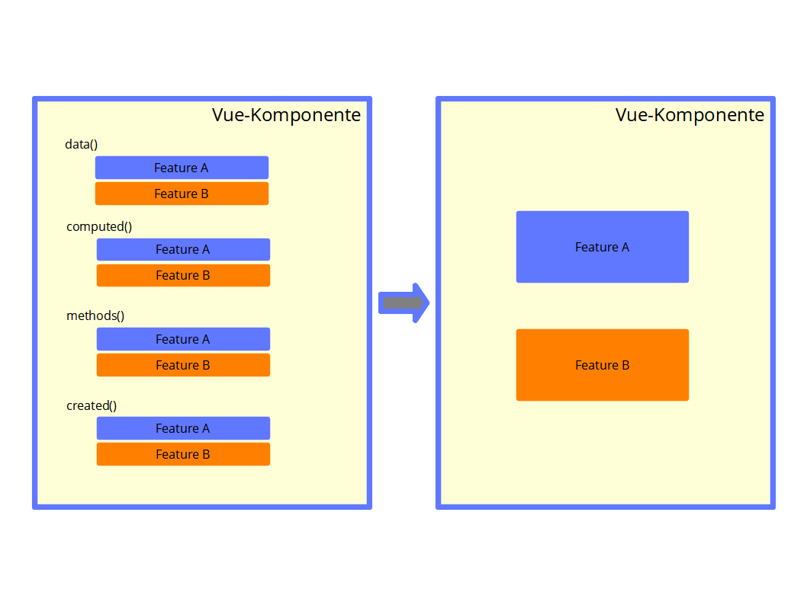

# Composition API



## Replacing data with ref 

### 1. Beispiel

#### App.vue (Parent)

```js
<template>
  <div class="container px-6 py-16 max-w-md mx-auto">
    <div class="prose text-center mb-4">
      <h1>
        Replacing data with ref
      </h1>
      <div class="mt-8">
        <Data />
      </div>
      <div class="mt-8">
        <DataAPI />
      </div>
    </div>
  </div>
</template>
<script>
import Data from "./components/api/Data";
import DataAPI from "./components/api/DataAPI";
export default {
  name: "App",
  //
  components: {
    Data,
    DataAPI,
  },
};
</script>
```

#### Data.vue (Child)

```js
<template>
  <h2>Alte Schreibweise: {{ firstName }}</h2>
</template>
<script>
export default {
  name: "Data",
  //
  data() {
    return {
      firstName: "Klaus",
    };
  },
};
</script>
```

#### DataAPI.vue (Child)

```js
<template>
  <h2>Neue Schreibweise: {{ firstName }}</h2>
</template>
<script>
import { ref } from "vue";
export default {
  name: "DataAPI",
  //
  setup() {
      const firstName = ref('Klaus')
      return {
          firstName: firstName
      }
  },
};
</script>
```

### 2. Beispiel

#### App.vue (Parent)

```js
<template>
  <div class="container px-6 py-16 max-w-md mx-auto">
    <div class="prose text-center mb-4">
      <h1>
        Replacing data with ref
      </h1>
      <div class="mt-8">
        <Data />
      </div>
      <div class="mt-8">
        <DataAPI />
      </div>
    </div>
  </div>
</template>
<script>
import Data from "./components/api/Data";
import DataAPI from "./components/api/DataAPIV2";
export default {
  name: "App",
  //
  components: {
    Data,
    DataAPI,
  },
};
</script>
```

#### Data.vue (Child)

```js
<template>
  <h2>Alte Schreibweise: {{ firstName }}</h2>
</template>
<script>
export default {
  name: "Data",
  //
  data() {
    return {
      firstName: "Klaus",
    };
  },
};
</script>
```

#### DataAPIV2.vue (Child)

```js
<template>
  <h2>Neue Schreibweise: {{ firstName }}</h2>
  <p>{{ greeting }} </p>
</template>
<script>
import { ref } from "vue";
export default {
  name: "DataAPI",
  //
  setup() {
    const firstName = ref("Klaus");
    firstName.value = 'Angela';
    const greeting = `Hallo ${firstName.value}`
    console.log("firstName: ", firstName);
    return {
      firstName,
      greeting
    };
  },
};
</script>
```

## Replacing data with reactive

### 1. Beispiel

#### App.vue (Parent)

```js
<template>
  <div class="container px-6 py-16 max-w-md mx-auto">
    <div class="prose text-center mb-4">
      <h1>
        Replacing data with reactive
      </h1>
      <div class="mt-8">
        <DataReactive />
      </div>
      <div class="mt-8">
        <DataReactiveAPI />
      </div>
    </div>
  </div>
</template>
<script>
import DataReactive from "./components/api/DataReactive";
import DataReactiveAPI from "./components/api/DataReactiveAPI";
export default {
  name: "App",
  //
  components: {
    DataReactive,
    DataReactiveAPI,
  },
};
</script>
```

#### DataReactive.vue (Child)

```js
<template>
  <h2>Alte Schreibweise</h2>
  <h3>{{ firstName }}</h3>
  <h3>{{ lastName }}</h3>
  <h3>{{ club }}</h3>
</template>
<script>
export default {
  name: "Data",
  //
  data() {
    return {
      firstName: "Gerd",
      lastName: "Müller",
      club: "Bayern München",
    };
  },
};
</script>
```

#### DataReactiveAPI.vue (Child)

```js
<template>
  <h2>Neue Schreibweise</h2>
  <h3>{{ state.firstName }}</h3>
  <h3>{{ state.lastName }}</h3>
  <h3>{{ state.club }}</h3>
  <p>{{ greeting }}</p>
</template>
<script>
import { reactive } from "vue";
export default {
  name: "DataAPI",
  //
  setup() {
    const state = reactive({
      firstName: "Gerd",
      lastName: "Müller",
      club: "Bayern München",
    });
    //
    const greeting = `Hallo ${state.firstName} ${state.lastName} (${state.club})`;
    //
    return {
      state,
      greeting,
    };
  },
};
</script>
```

## Reactivity

### 1. Beispiel

#### App.vue (Parent)

```js
<template>
  <div class="container px-6 py-16 max-w-md mx-auto">
    <div class="prose text-center mb-4">
      <h1>
        Reactivity
      </h1>
      <div class="mt-8">
        <ReactivityAPIA />
      </div>
    </div>
  </div>
</template>
<script>
import ReactivityAPIA from "./components/api/ReactivityAPIA";
export default {
  name: "App",
  //
  components: {
    ReactivityAPIA,
  },
};
</script>
```

#### ReactiveAPIA.vue (Child)

```js
<template>
  <div>
    <h2>{{ framework }}</h2>
  </div>
</template>
<script>
import { ref } from "vue";
export default {
  name: "ReactivityAPIA",
  //
  setup() {
    let framework = ref("Vue 2");
    //
    setTimeout(() => {
      framework.value = "Vue 3";
      console.log("new framework:", framework);
    }, 2000);
    //
    return {
      framework,
    };
  },
};
</script>
```

### 2. Beispiel

#### App.vue (Parent)

```js
<template>
  <div class="container px-6 py-16 max-w-md mx-auto">
    <div class="prose text-center mb-4">
      <h1>
        Reactivity
      </h1>
      <div class="mt-8">
        <ReactivityAPIB />
      </div>
    </div>
  </div>
</template>
<script>
import ReactivityAPIB from "./components/api/ReactivityAPIB";
export default {
  name: "App",
  //
  components: {
    ReactivityAPIB,
  },
};
</script>
```

#### ReactivityAPIB.vue (Child)

```js
<template>
  <div>
    <h2>{{ firstName }} {{ lastName }}</h2>
  </div>
</template>
<script>
import { reactive, toRefs } from "vue";
export default {
  name: "ReactivityAPIB",
  //
  setup() {
    const state = reactive({
      firstName: "Angela",
      lastName: "Merkel",
    });
    //
    setTimeout(() => {
      state.firstName = "Annalena";
      state.lastName = "Baerbock";
      console.log("new state:", state);
    }, 2000);
    //
    return toRefs(state);
  },
};
</script>
```

## Methods

### 1. Beispiel

#### App.vue (Parent)

```js
<template>
  <div class="container px-6 py-16 max-w-md mx-auto">
    <div class="prose text-center mb-4">
      <h1>
        Methods
      </h1>
      <div class="mt-8">
        <Methods />
      </div>
      <div class="mt-8">
        <MethodsAPIRef />
      </div>
      <div class="mt-8">
        <MethodsAPIReactive />
      </div>
    </div>
  </div>
</template>
<script>
import Methods from "./components/api/Methods";
import MethodsAPIRef from "./components/api/MethodsAPIRef";
import MethodsAPIReactive from "./components/api/MethodsAPIReactive";
export default {
  name: "App",
  //
  components: {
    Methods,
    MethodsAPIRef,
    MethodsAPIReactive
  },
};
</script>
```

#### Methods.vue (Child)

```js
<template>
  <h2>Alte Schreibweise</h2>
  <h3>{{ firstName }} {{ lastName }}</h3>
  <h4>{{ goals }}</h4>
  <div class="btn-group justify-center">
    <button v-on:click.prevent="changeName" class="btn btn-sm btn-primary">
      Namen ändern
    </button>
    <button v-on:click.prevent="newGoal" class="btn btn-sm btn-secondary">Tor erzielt</button>
  </div>
</template>
<script>
export default {
  name: "Methods",
  //
  data() {
    return {
      firstName: "Gerd",
      lastName: "Müller",
      goals: 0,
    };
  },
  //
  methods: {
    changeName() {
      this.firstName = "Klaus";
    },
    newGoal() {
      this.goals++;
    },
  },
};
</script>
```

#### MethodsAPIRef.vue (Child)

```js
<template>
  <h2>Neue Schreibweise mit Ref</h2>
  <h3>{{ firstName }} {{ lastName }}</h3>
  <h4>{{ goals }}</h4>
  <div class="btn-group justify-center">
    <button v-on:click.prevent="changeName" class="btn btn-sm btn-primary">
      Namen ändern
    </button>
    <button v-on:click.prevent="newGoal" class="btn btn-sm btn-secondary">
      Tor erzielt
    </button>
  </div>
</template>
<script>
import { ref } from "vue";
export default {
  name: "MethodsAPIRef",
  //
  setup() {
    const firstName = ref("Gerd");
    const lastName = ref("Müller");
    const goals = ref(0);
    //
    function changeName() {
      this.firstName = "Klaus";
      this.lastName = "Fischer";
    }
    //
    function newGoal() {
      goals.value++;
    }
    //
    return {
      firstName,
      lastName,
      goals,
      changeName,
      newGoal
    };
  },
};
</script>
```

#### MethodsAPIReactive.vue (Child)

```js
<template>
  <h2>Neue Schreibweise mit Reactive</h2>
  <h3>{{ firstName }} {{ lastName }}</h3>
  <h4>{{ goals }}</h4>
  <div class="btn-group justify-center">
    <button v-on:click.prevent="changeName" class="btn btn-sm btn-primary">
      Namen ändern
    </button>
    <button v-on:click.prevent="newGoal" class="btn btn-sm btn-secondary">
      Tor erzielt
    </button>
  </div>
</template>
<script>
import { reactive, toRefs } from "vue";
export default {
  name: "MethodsAPIReactive",
  //
  setup() {
    const state = reactive({
      firstName: "Gerd",
      lastName: "Müller",
      goals: 0
    });
    //
    function changeName() {
      state.firstName = "Klaus";
      state.lastName = "Fischer";
    }
    //
    function newGoal() {
      state.goals++;
    }
    //
    return {
      ...toRefs(state),
      changeName,
      newGoal,
    };
  },
};
</script>
```

## v-model

### 1. Beispiel

#### App.vue (Parent)

```js
<template>
  <div class="container px-6 py-16 max-w-md mx-auto">
    <div class="prose text-center mb-4">
      <h1>
        v-model & Composition API
      </h1>
      <div class="mt-8">
        <h4>Alte Schreibweise</h4>
        <VModel />
      </div>
      <div class="mt-8">
        <h4>Composition API mit Ref</h4>
        <VModelAPIRef />
      </div>
      <div class="mt-8">
        <h4>Composition API mit Reactive</h4>
        <VModelAPIReactive />
      </div>
    </div>
  </div>
</template>
<script>
import VModel from "./components/api/VModel";
import VModelAPIRef from "./components/api/VModelAPIRef";
import VModelAPIReactive from "./components/api/VModelAPIReactive";
export default {
  name: "App",
  //
  components: {
    VModel,
    VModelAPIRef,
    VModelAPIReactive,
  },
};
</script>
```

#### VModel.vue (Child)

```js
<template>
  <div class="p-2 flex flex-wrap items-center justify-between -mx-2">
    <div class="form-control w-1/2 px-2">
      <label class="label" for="firstName">
        <span class="label-text">Vorname</span>
      </label>
      <input
        type="text"
        id="firstName"
        v-model="firstName"
        placeholder="Vorname"
        class="input input-bordered"
      />
    </div>
    <div class="form-control w-1/2">
      <label class="label" for="lastName">
        <span class="label-text">Nachname</span>
      </label>
      <input
        type="text"
        id="lastName"
        v-model="lastName"
        placeholder="Nachname"
        class="input input-bordered"
      />
    </div>
  </div>
</template>
<script>
export default {
  name: "VModel",
  //
  data() {
    return {
      firstName: "",
      lastName: "",
    };
  },
};
</script>
```

#### VModelAPIRef.vue (Child)

```js
<template>
  <div class="p-2 flex flex-wrap items-center justify-between -mx-2">
    <div class="form-control w-1/2 px-2">
      <label class="label" for="firstName">
        <span class="label-text">Vorname</span>
      </label>
      <input
        type="text"
        id="firstName"
        v-model="firstName"
        placeholder="Vorname"
        class="input input-bordered"
      />
    </div>
    <div class="form-control w-1/2">
      <label class="label" for="lastName">
        <span class="label-text">Nachname</span>
      </label>
      <input
        type="text"
        id="lastName"
        v-model="lastName"
        placeholder="Nachname"
        class="input input-bordered"
      />
    </div>
  </div>
</template>
<script>
import { ref } from "vue";
export default {
  name: "VModelAPIRef",
  //
  setup() {
    const firstName = ref("");
    const lastName = ref("");
    //
    return {
      firstName,
      lastName
    }
  },
};
</script>
```

#### VModelAPIReactive.vue (Child)

```js
<template>
  <div class="p-2 flex flex-wrap items-center justify-between -mx-2">
    <div class="form-control w-1/2 px-2">
      <label class="label" for="firstName">
        <span class="label-text">Vorname</span>
      </label>
      <input
        type="text"
        id="firstName"
        v-model="firstName"
        placeholder="Vorname"
        class="input input-bordered"
      />
    </div>
    <div class="form-control w-1/2">
      <label class="label" for="lastName">
        <span class="label-text">Nachname</span>
      </label>
      <input
        type="text"
        id="lastName"
        v-model="lastName"
        placeholder="Nachname"
        class="input input-bordered"
      />
    </div>
  </div>
</template>
<script>
import { reactive, toRefs } from "vue";
export default {
  name: "VModelAPIReactive",
  //
  setup() {
    const state = reactive({
      firstName: "",
      lastName: "",
    });
    //
    return {
      ...toRefs(state),
    };
  },
};
</script>
```

## Computed Properties

### 1. Beispiel

#### App.vue (Parent)

```js
<template>
  <div class="container px-6 py-16 max-w-md mx-auto">
    <div class="prose text-center mb-4">
      <h1>
        Computed Properties & Composition API
      </h1>
      <div class="mt-8">
        <h4>Alte Schreibweise</h4>
        <Computed />
      </div>
      <div class="mt-8">
        <h4>Composition API mit Ref</h4>
        <ComputedAPIRef />
      </div>
      <div class="mt-8">
        <h4>Composition API mit Reactive</h4>
        <ComputedAPIReactive />
      </div>
    </div>
  </div>
</template>
<script>
import Computed from "./components/api/Computed";
import ComputedAPIRef from "./components/api/ComputedAPIRef";
import ComputedAPIReactive from "./components/api/ComputedAPIReactive";
export default {
  name: "App",
  //
  components: {
    Computed,
    ComputedAPIRef,
    ComputedAPIReactive,
  },
};
</script>
```

#### Computed.vue (Child)

```js
<template>
  <div class="p-2 flex flex-wrap items-center justify-between -mx-2">
    <div class="form-control w-1/2 px-2">
      <label class="label" for="firstName">
        <span class="label-text">Vorname</span>
      </label>
      <input
        type="text"
        id="firstName"
        v-model="firstName"
        placeholder="Vorname"
        class="input input-bordered"
      />
    </div>
    <div class="form-control w-1/2">
      <label class="label" for="lastName">
        <span class="label-text">Nachname</span>
      </label>
      <input
        type="text"
        id="lastName"
        v-model="lastName"
        placeholder="Nachname"
        class="input input-bordered"
      />
    </div>
    <h2>{{ fullName }}</h2>
  </div>
</template>
<script>
export default {
  name: "Computed",
  //
  data() {
    return {
      firstName: "",
      lastName: "",
    };
  },
  //
  computed: {
      fullName() {
          return `${this.firstName} ${this.lastName}`
      }
  }
};
</script>
```

#### ComputedAPIRef.vue (Child)

```js
<template>
  <div class="p-2 flex flex-wrap items-center justify-between -mx-2">
    <div class="form-control w-1/2 px-2">
      <label class="label" for="firstNameAPIRef">
        <span class="label-text">Vorname</span>
      </label>
      <input
        type="text"
        id="firstNameAPIRef"
        v-model="firstName"
        placeholder="Vorname"
        class="input input-bordered"
      />
    </div>
    <div class="form-control w-1/2">
      <label class="label" for="lastNameAPIRef">
        <span class="label-text">Nachname</span>
      </label>
      <input
        type="text"
        id="lastNameAPIRef"
        v-model="lastName"
        placeholder="Nachname"
        class="input input-bordered"
      />
    </div>
    <h2>{{ fullName }}</h2>
  </div>
</template>
<script>
import { ref, computed } from "vue";
export default {
  name: "ComputedAPIRef",
  //
  setup() {
    const firstName = ref("");
    const lastName = ref("");
    //
    const fullName = computed(function() {
      return `${firstName.value} ${lastName.value}`;
    });
    //
    return {
      firstName,
      lastName,
      fullName
    };
  },
};
</script>
```

#### ComputedAPIReactive.vue (Child)

```js
<template>
  <div class="p-2 flex flex-wrap items-center justify-between -mx-2">
    <div class="form-control w-1/2 px-2">
      <label class="label" for="firstNameAPIReactive">
        <span class="label-text">Vorname</span>
      </label>
      <input
        type="text"
        id="firstNameAPIReactive"
        v-model="firstName"
        placeholder="Vorname"
        class="input input-bordered"
      />
    </div>
    <div class="form-control w-1/2">
      <label class="label" for="lastNameAPIReactive">
        <span class="label-text">Nachname</span>
      </label>
      <input
        type="text"
        id="lastNameAPIReactive"
        v-model="lastName"
        placeholder="Nachname"
        class="input input-bordered"
      />
    </div>
    <h2>{{ fullName }}</h2>
  </div>
</template>
<script>
import { reactive, toRefs, computed } from "vue";
export default {
  name: "ComputedAPIReactive",
  //
  setup() {
    const state = reactive({
      firstName: "",
      lastName: "",
    });
    //
    const fullName = computed(function() {
      return `${state.firstName} ${state.lastName}`;
    });
    //
    return {
      ...toRefs(state),
      fullName
    };
  },
};
</script>
```

## Watcher

### 1. Beispiel

#### App.vue (Parent)

```js
<template>
  <div class="container px-6 py-16 max-w-md mx-auto">
    <div class="prose text-center mb-4">
      <h1>
        Watch & Composition API
      </h1>
      <div class="mt-8">
        <h4>Alte Schreibweise</h4>
        <Watch />
      </div>
      <div class="mt-8">
        <h4>Composition API mit Ref</h4>
        <WatchAPIRef />
      </div>
      <div class="mt-8">
        <h4>Composition API mit Reactive</h4>
        <WatchAPIReactive />
      </div>
    </div>
  </div>
</template>
<script>
import Watch from "./components/api/Watch";
import WatchAPIRef from "./components/api/WatchAPIRef";
import WatchAPIReactive from "./components/api/WatchAPIReactive";
export default {
  name: "App",
  //
  components: {
    Watch,
    WatchAPIRef,
    WatchAPIReactive,
  },
};
</script>
```

#### Watch.vue (Child)

```js
<template>
  <div class="p-2 flex flex-wrap items-center justify-between -mx-2">
    <div class="form-control w-1/2 px-2">
      <label class="label" for="firstName">
        <span class="label-text">Vorname</span>
      </label>
      <input
        type="text"
        id="firstName"
        v-model="firstName"
        placeholder="Vorname"
        class="input input-bordered"
      />
    </div>
    <div class="form-control w-1/2 px-2">
      <label class="label" for="lastName">
        <span class="label-text">Nachname</span>
      </label>
      <input
        type="text"
        id="lastName"
        v-model="lastName"
        placeholder="Nachname"
        class="input input-bordered"
      />
    </div>
  </div>
</template>
<script>
export default {
  name: "Watch",
  //
  data() {
    return {
      firstName: "Gerd",
      lastName: "Müller",
    };
  },
  //
  watch: {
    firstName(newValue, oldValue) {
      console.log("Watch old value: ", oldValue);
      console.log("Watch new value: ", newValue);
    },
    lastName(newValue, oldValue) {
      console.log("Watch old value: ", oldValue);
      console.log("Watch new value: ", newValue);
    },
  },
};
</script>
```

#### WatchAPIRef.vue (Child)

```js
<template>
  <div class="p-2 flex flex-wrap items-center justify-between -mx-2">
    <div class="form-control w-1/2 px-2">
      <label class="label" for="firstNameAPIRef">
        <span class="label-text">Vorname</span>
      </label>
      <input
        type="text"
        id="firstNameAPIRef"
        v-model="firstName"
        placeholder="Vorname"
        class="input input-bordered"
      />
    </div>
    <div class="form-control w-1/2 px-2">
      <label class="label" for="lastNameAPIRef">
        <span class="label-text">Nachname</span>
      </label>
      <input
        type="text"
        id="lastNameAPIRef"
        v-model="lastName"
        placeholder="Nachname"
        class="input input-bordered"
      />
    </div>
  </div>
</template>
<script>
import { ref, watch } from "vue";
export default {
  name: "WatchAPIRef",
  //
  setup() {
    const firstName = ref("Klaus");
    const lastName = ref("Fischer");
    //
    watch(firstName, (newValue, oldValue) => {
      console.log("WatchAPIRef firstName old value: ", oldValue);
      console.log("WatchAPIRef firstName new value: ", newValue);
    });
    //
    watch(lastName, (newValue, oldValue) => {
      console.log("WatchAPIRef lastName old value: ", oldValue);
      console.log("WatchAPIRef lastName new value: ", newValue);
    });
    //
    return {
      firstName,
      lastName
    };
  }
};
</script>
```

#### WatchAPIReactive.vue (Child)
```js
<template>
  <div class="p-2 flex flex-wrap items-center justify-between -mx-2">
    <div class="form-control w-1/2 px-2">
      <label class="label" for="firstNameAPIReactive">
        <span class="label-text">Vorname</span>
      </label>
      <input
        type="text"
        id="firstNameAPIReactive"
        v-model="firstName"
        placeholder="Vorname"
        class="input input-bordered"
      />
    </div>
    <div class="form-control w-1/2 px-2">
      <label class="label" for="lastNameAPIReactive">
        <span class="label-text">Nachname</span>
      </label>
      <input
        type="text"
        id="lastNameAPIReactive"
        v-model="lastName"
        placeholder="Nachname"
        class="input input-bordered"
      />
    </div>
  </div>
</template>
<script>
import { reactive, toRefs, watch } from "vue";
export default {
  name: "WatchAPIReactive",
  //
  setup() {
    const state = reactive({
      firstName: "Uwe",
      lastName: "Seeler",
    });
    //
    watch(
      state,
      function (newValue, oldValue)  {
        console.log("WatchAPIReactive firstName old value: ", oldValue.firstName);
        console.log("WatchAPIReactive firstName new values: ", newValue.firstName);
        console.log("WatchAPIReactive lastName old value: ", oldValue.lastName);
        console.log("WatchAPIReactive lastName new values: ", newValue.lastName);
      },
    );
    //
    return {
      ...toRefs(state),
    };
  },
};
</script>
```

#### WatchAPIRefV2.vue (Child)
Um diese Variante von WatchAPIRef zu verwenden, ersetze in der App.vue  

    import WatchAPIRef from "./components/api/WatchAPIRef";

durch

    import WatchAPIRef from "./components/api/WatchAPIRefV2";

```js
<template>
  <div class="p-2 flex flex-wrap items-center justify-between -mx-2">
    <div class="form-control w-1/2 px-2">
      <label class="label" for="firstNameAPIRef">
        <span class="label-text">Vorname</span>
      </label>
      <input
        type="text"
        id="firstNameAPIRef"
        v-model="firstName"
        placeholder="Vorname"
        class="input input-bordered"
      />
    </div>
    <div class="form-control w-1/2 px-2">
      <label class="label" for="lastNameAPIRef">
        <span class="label-text">Nachname</span>
      </label>
      <input
        type="text"
        id="lastNameAPIRef"
        v-model="lastName"
        placeholder="Nachname"
        class="input input-bordered"
      />
    </div>
  </div>
</template>
<script>
import { ref, watch } from "vue";
export default {
  name: "WatchAPIRef",
  //
  setup() {
    const firstName = ref("Klaus");
    const lastName = ref("Fischer");
    //
    watch(
      [firstName, lastName],
      (newValues, oldValues) => {
        console.log("WatchAPIRefV2 firstName old value: ", oldValues[0]);
        console.log("WatchAPIRefV2 firstName new value: ", newValues[0]);
        console.log("WatchAPIRefV2 lastName old value: ", oldValues[1]);
        console.log("WatchAPIRefV2 lastName new value: ", newValues[1]);
      },
      {
        immediate: false,
      }
    );
    //
    return {
      firstName,
      lastName,
    };
  },
};
</script>
```

#### WatchAPIReactiveV2.vue (Child)
Um diese Variante von WatchAPIReactive zu verwenden, ersetze in der App.vue  

    import WatchAPIRef from "./components/api/WatchAPIReactive";

durch

    import WatchAPIReactive from "./components/api/WatchAPIRReactiveV2";

```js
<template>
  <div class="p-2 flex flex-wrap items-center justify-between -mx-2">
    <div class="form-control w-1/2 px-2">
      <label class="label" for="firstNameAPIReactive">
        <span class="label-text">Vorname</span>
      </label>
      <input
        type="text"
        id="firstNameAPIReactive"
        v-model="firstName"
        placeholder="Vorname"
        class="input input-bordered"
      />
    </div>
    <div class="form-control w-1/2 px-2">
      <label class="label" for="lastNameAPIReactive">
        <span class="label-text">Nachname</span>
      </label>
      <input
        type="text"
        id="lastNameAPIReactive"
        v-model="lastName"
        placeholder="Nachname"
        class="input input-bordered"
      />
    </div>
  </div>
</template>
<script>
import { reactive, toRefs, watch } from "vue";
export default {
  name: "WatchAPIReactiveV2",
  //
  setup() {
    const state = reactive({
      firstName: "Uwe",
      lastName: "Seeler",
    });
    //
    watch(
      () => {
        return { ...state }
      },
      function (newValue, oldValue)  {
        console.log("WatchAPIReactive firstName old value: ", oldValue.firstName);
        console.log("WatchAPIReactive firstName new values: ", newValue.firstName);
        console.log("WatchAPIReactive lastName old value: ", oldValue.lastName);
        console.log("WatchAPIReactive lastName new values: ", newValue.lastName);
      },
    );
    //
    return {
      ...toRefs(state),
    };
  },
};
</script>
```

#### WatchAPIReactiveV3.vue (Child)
Um diese Variante von WatchAPIReactive zu verwenden, ersetze in der App.vue  

    import WatchAPIRef from "./components/api/WatchAPIReactive";

durch

    import WatchAPIReactive from "./components/api/WatchAPIRReactiveV3";

```js
<template>
  <div class="p-2 flex flex-wrap items-center justify-between -mx-2">
    <div class="form-control w-1/2 px-2">
      <label class="label" for="firstNameAPIReactive">
        <span class="label-text">Vorname</span>
      </label>
      <input
        type="text"
        id="firstNameAPIReactive"
        v-model="firstName"
        placeholder="Vorname"
        class="input input-bordered"
      />
    </div>
    <div class="form-control w-1/2 px-2">
      <label class="label" for="lastNameAPIReactive">
        <span class="label-text">Nachname</span>
      </label>
      <input
        type="text"
        id="lastNameAPIReactive"
        v-model="lastName"
        placeholder="Nachname"
        class="input input-bordered"
      />
    </div>
  </div>
</template>
<script>
import { reactive, toRefs, watch } from "vue";
export default {
  name: "WatchAPIReactiveV3",
  //
  setup() {
    const state = reactive({
      firstName: "Uwe",
      lastName: "Seeler",
    });
    //
    watch(
      () => state.firstName,
      function(newValue, oldValue) {
        console.log(
          "WatchAPIReactive firstName old value: ",
          oldValue
        );
        console.log(
          "WatchAPIReactive firstName new values: ",
          newValue
        );
      }
    );
    //
    return {
      ...toRefs(state),
    };
  },
};
</script>
```

#### WatchAPIReactiveV4.vue (Child)
Um diese Variante von WatchAPIReactive zu verwenden, ersetze in der App.vue  

    import WatchAPIRef from "./components/api/WatchAPIReactive";

durch

    import WatchAPIReactive from "./components/api/WatchAPIRReactiveV4";

```js
<template>
  <div class="p-2 flex flex-wrap items-center justify-between -mx-2">
    <div class="form-control w-1/2 px-2">
      <label class="label" for="firstNameAPIReactive">
        <span class="label-text">Vorname</span>
      </label>
      <input
        type="text"
        id="firstNameAPIReactive"
        v-model="firstName"
        placeholder="Vorname"
        class="input input-bordered"
      />
    </div>
    <div class="form-control w-1/2 px-2">
      <label class="label" for="lastNameAPIReactive">
        <span class="label-text">Nachname</span>
      </label>
      <input
        type="text"
        id="lastNameAPIReactive"
        v-model="lastName"
        placeholder="Nachname"
        class="input input-bordered"
      />
    </div>
    <div class="form-control w-1/2 px-2">
      <label class="label" for="offensiveAPIReactive">
        <span class="label-text">Offensivfähigkeit</span>
      </label>
      <input
        type="text"
        id="offensiveAPIReactive"
        v-model.number="skills.offensive"
        placeholder="Offensivfähigkeit"
        class="input input-bordered"
      />
    </div>
  </div>
</template>
<script>
import { reactive, toRefs, watch } from "vue";
export default {
  name: "WatchAPIReactiveV4",
  //
  setup() {
    const state = reactive({
      firstName: "Uwe",
      lastName: "Seeler",
      skills: {
        offensive: 9,
      },
    });
    //
    watch(
      () => state.skills,
      function(newValue, oldValue) {
        console.log(
          "WatchAPIReactive state.skills old value: ",
          oldValue
        );
        console.log(
          "WatchAPIReactive state.skills new values: ",
          newValue
        );
      },
      {
        deep: true
      }
    );
    //
    return {
      ...toRefs(state),
    };
  },
};
</script>
```

#### WatchAPIReactiveV5.vue (Child)
Um diese Variante von WatchAPIReactive zu verwenden, ersetze in der App.vue  

    import WatchAPIRef from "./components/api/WatchAPIReactive";

durch

    import WatchAPIReactive from "./components/api/WatchAPIRReactiveV5";

```js
<template>
  <div class="p-2 flex flex-wrap items-center justify-between -mx-2">
    <div class="form-control w-1/2 px-2">
      <label class="label" for="firstNameAPIReactive">
        <span class="label-text">Vorname</span>
      </label>
      <input
        type="text"
        id="firstNameAPIReactive"
        v-model="firstName"
        placeholder="Vorname"
        class="input input-bordered"
      />
    </div>
    <div class="form-control w-1/2 px-2">
      <label class="label" for="lastNameAPIReactive">
        <span class="label-text">Nachname</span>
      </label>
      <input
        type="text"
        id="lastNameAPIReactive"
        v-model="lastName"
        placeholder="Nachname"
        class="input input-bordered"
      />
    </div>
    <div class="form-control w-1/2 px-2">
      <label class="label" for="offensiveAPIReactive">
        <span class="label-text">Offensivfähigkeit</span>
      </label>
      <input
        type="text"
        id="offensiveAPIReactive"
        v-model.number="skills.offensive"
        placeholder="Offensivfähigkeit"
        class="input input-bordered"
      />
    </div>
  </div>
</template>
<script>
import _ from 'lodash'
import { reactive, toRefs, watch } from "vue";
export default {
  name: "WatchAPIReactiveV5",
  //
  setup() {
    const state = reactive({
      firstName: "Uwe",
      lastName: "Seeler",
      skills: {
        offensive: 9,
      },
    });
    //
    watch(
      () => _.cloneDeep(state.skills),
      function(newValue, oldValue) {
        console.log(
          "WatchAPIReactive state.skills old value: ",
          oldValue
        );
        console.log(
          "WatchAPIReactive state.skills new values: ",
          newValue
        );
      },
      {
        deep: true
      }
    );
    //
    return {
      ...toRefs(state),
    };
  },
};
</script>
```

## Provide & Inject

### 1. Beispiel

#### App.vue (Parent)

```js
<template>
  <div class="container px-6 py-16 max-w-md mx-auto">
    <div class="prose text-center mb-4">
      <h1>
        Provide & Inject (Composition API)
      </h1>
      <div class="mt-8">
        <h4>Alte Schreibweise</h4>
        <ProvideInject />
      </div>
    </div>
  </div>
</template>
<script>
import ProvideInject from "./components/api/ProvideInject";
export default {
  name: "App",
  //
  components: {
    ProvideInject,
  },
};
</script>
```

#### ProvideInject.vue (Child)

```js
<template>
  <h3>ProvideInject: {{ framework }}</h3>
  <ChildA />
</template>
<script>
import ChildA from "./ChildA.vue";
export default {
  //
  name: "ProvideInject",
  //
  components: {
    ChildA,
  },
  //
  data() {
    return {
      framework: "Vue 3",
    };
  },
  provide() {
    return {
      frameworkName: this.framework,
    };
  },
};
</script>
```

#### ChildA.vue (Child)

```js
<template>
  <h4>Child A</h4>
  <ChildB />
</template>
<script>
import ChildB from './ChildB'
export default {
  name: "ChildA",
  //
  components: {
      ChildB
  }
};
</script>
```

#### ChildB.vue (Child)

```js
<template>
  <h4>Child B</h4>
  <ChildC />
</template>
<script>
import ChildC from './ChildC'
export default {
  name: "ChildB",
  //
  components: {
      ChildC
  }
};
</script>
```

#### ChildC.vue (Child)

```js
<template>
  <h4>Child C</h4>
  <div>Name of the framework: {{ frameworkName }}</div>
</template>
<script>
export default {
  name: "ChildC",
  //
  inject: ['frameworkName']
};
</script>
```

### 2. Beispiel

#### App.vue (Parent)

```js
<template>
  <div class="container px-6 py-16 max-w-md mx-auto">
    <div class="prose text-center mb-4">
      <h1>
        Provide & Inject (Composition API)
      </h1>
      <div class="mt-8">
        <h4>Neue Schreibweise</h4>
        <ProvideInjectAPI />
      </div>
    </div>
  </div>
</template>
<script>
import ProvideInjectAPI from "./components/api/ProvideInjectAPI";
export default {
  name: "App",
  //
  components: {
    ProvideInjectAPI,
  },
};
</script>
```

#### ProvideInjectAPI.vue (Child)

```js
<template>
  <h3>ProvideInjectAPI</h3>
  <ChildA />
</template>
<script>
import { provide } from 'vue'
import ChildA from "./ChildAAPI.vue";
export default {
  //
  name: "ProvideInjectAPI",
  //
  components: {
    ChildA,
  },
  //  
  setup() {
    provide('frameworkNameAPI', 'Vue 3')
  },
};
</script>
```

#### ChildAAPI.vue (Child)

```js
<template>
  <h4>Child A</h4>
  <ChildB />
</template>
<script>
import ChildB from './ChildBAPI'
export default {
  name: "ChildAAPI",
  //
  components: {
      ChildB
  }
};
</script>
```

#### ChildBAPI.vue (Child)

```js
<template>
  <h4>Child B</h4>
  <ChildC />
</template>
<script>
import ChildC from './ChildCAPI'
export default {
  name: "ChildBAPI",
  //
  components: {
      ChildC
  }
};
</script>
```

#### ChildCAPI.vue (Child)

```js
<template>
  <h4>Child C</h4>
  <div>Name of the framework: {{ frameworkNameAPI }}</div>
</template>
<script>
import { inject } from "vue";
export default {
  name: "ChildCAPI",
  //
  setup() {
    const frameworkNameAPI = inject("frameworkNameAPI", "Default framework");
    //
    return {
      frameworkNameAPI,
    };
  },
};
</script>
```

### 3. Beispiel

#### App.vue (Parent)

```js
<template>
  <div class="container px-6 py-16 max-w-md mx-auto">
    <div class="prose text-center mb-4">
      <h1>
        Provide & Inject (Composition API)
      </h1>
      <div class="mt-8">
        <h4>Neue Schreibweise</h4>
        <ProvideInjectAPI />
      </div>
    </div>
  </div>
</template>
<script>
import ProvideInjectAPI from "./components/api/ProvideInjectAPIV2";
export default {
  name: "App",
  //
  components: {
    ProvideInjectAPI,
  },
};
</script>
```

#### ProvideInjectAPIV2.vue (Child)

```js
<template>
  <h3>ProvideInjectAPI</h3>
  <p>Spieler: {{ firstName }} {{ lastName }}</p>
  <p>erzielte Bundesligatore: {{ goals }}</p>
  <ChildA />
</template>
<script>
import { provide, ref, reactive, toRefs } from 'vue'
import ChildA from "./ChildAAPIV2.vue";
export default {
  //
  name: "ProvideInjectAPIV2",
  //
  components: {
    ChildA,
  },
  //  
  setup() {
    const goals = ref(329)
    const state = reactive({
      firstName: 'Gerd',
      lastName: 'Müller'
    })
    //
    provide('c_goals', goals)
    provide('c_player', state)
    //
    return {
      goals,
      ...toRefs(state)
    }
  },
};
</script>
```

#### ChildAAPIV2.vue (Child)

```js
<template>
  <h4>Child A</h4>
  <ChildB />
</template>
<script>
import ChildB from './ChildBAPIV2'
export default {
  name: "ChildAAPI",
  //
  components: {
      ChildB
  }
};
</script>
```

#### ChildBAPIV2.vue (Child)

```js
<template>
  <h4>Child B</h4>
  <ChildC />
</template>
<script>
import ChildC from './ChildCAPIV2'
export default {
  name: "ChildBAPI",
  //
  components: {
      ChildC
  }
};
</script>
```

#### ChildCAPIV2.vue (Child)

```js
<template>
  <h4>Child C</h4>
  <p>Spieler: {{ firstName }} {{ lastName }}</p>
  <p>erzielte Bundesligatore: {{ childGoals }}</p>
</template>
<script>
import { inject, toRefs } from "vue";
export default {
  name: "ChildCAPIV2",
  //
  setup() {
    const childGoals = inject("c_goals", 0);
    const childPlayer = inject("c_player", {
      firstName: "Klaus",
      lastName: "Fischer",
    });
    //
    return {
      childGoals,
      ...toRefs(childPlayer),
    };
  },
};
</script>
```

## Lifecycle Hooks

### 1. Beispiel

#### App.vue (Parent)

```js
<template>
  <div class="container px-6 py-16 max-w-md mx-auto">
    <div class="prose text-center mb-4">
      <h1>
        Lifecycle Hooks (Composition API)
      </h1>
      <div class="mt-8">
        <h4>Alte Schreibweise</h4>
        <Lifecycle />
      </div>
      <div class="mt-8">
        <h4>Composition API</h4>
        <LifecycleAPI />
      </div>
    </div>
  </div>
</template>
<script>
import Lifecycle from "./components/api/Lifecycle";
import LifecycleAPI from "./components/api/LifecycleAPI";
export default {
  name: "App",
  //
  components: {
    Lifecycle,
    LifecycleAPI
  },
};
</script>
```

#### Lifecycle.vue (Child)

```js
<template>
  <div>
    <h5>Lifecycle Hooks in Lifecycle</h5>
  </div>
</template>
<script>

export default {
  name: "Lifecycle",
  //
  //
  beforeCreate() {
    console.log("Lifecycle beforeCreate");
  },
  //
  created() {
    console.log("Lifecycle created");
  },
  //
  beforeMount() {
    console.log("Lifecycle beforeMount");
  },
  //
  mounted() {
    console.log("Lifecycle mounted");
  },
  //
  beforeUpdate() {
    console.log("Lifecycle beforeUpdate");
  },
  //
  updated() {
    console.log("Lifecycle updated");
  },
  //
  beforeUnmount() {
    console.log("Lifecycle beforeUnmount");
  },
  //
  unmounted() {
    console.log("Lifecycle unmounted");
  },
};
</script>
```

#### LifecycleAPI.vue (Child)

```js
<template>
  <div>
    <h5>Lifecycle Hooks in LifecycleAPI</h5>
  </div>
</template>
<script>
import {
  onBeforeMount,
  onMounted,
  onBeforeUpdate,
  onUpdated,
  onBeforeUnmount,
  onUnmounted,
} from "vue";
export default {
  name: "LifecycleAPI",
  //
  setup() {
    console.log("LifecycleAPI setup");
    onBeforeMount(() => {
      console.log("LifecycleAPI onBeforeMount");
    });
    onMounted(() => {
      console.log("LifecycleAPI onMounted");
    });
    onBeforeUpdate(() => {
      console.log("LifecycleAPI onBeforeUpdate");
    });
    onUpdated(() => {
      console.log("LifecycleAPI onUpdated");
    });
    onBeforeUnmount(() => {
      console.log("LifecycleAPI onBeforeUnmount");
    });
    onUnmounted(() => {
      console.log("LifecycleAPI onUnmounted");
    });
  },
};
</script>
```

##  Template Refs

### 1. Beispiel

#### App.vue (Parent)

```js
<template>
  <div class="container px-6 py-16 max-w-md mx-auto">
    <div class="prose text-center mb-4">
      <h1>
        Template Refs (Composition API)
      </h1>
      <div class="mt-8">
        <h4>Alte Schreibweise</h4>
        <TemplateRef />
      </div>
    </div>
  </div>
</template>
<script>
import TemplateRef from "./components/api/TemplateRef";
export default {
  name: "App",
  //
  components: {
    TemplateRef,
  },
};
</script>
```

#### TemplateRef.vue (Child)

```js
<template>
  <div class="form-control px-2">
    <label class="label" for="firstName">
      <span class="label-text">Vorname</span>
    </label>
    <input
      type="text"
      id="firstName"
      ref="firstName"
      v-model="firstName"
      placeholder="Vorname"
      class="input input-bordered"
    />
  </div>
</template>
<script>
export default {
  name: "TemplateRef",
  //
  data() {
    return {
      firstName: "Gerd",
    };
  },
  //
  mounted() {
    this.$refs.firstName.focus();
  },
};
</script>
```

### 2. Beispiel

#### App.vue (Parent)

```js
<template>
  <div class="container px-6 py-16 max-w-md mx-auto">
    <div class="prose text-center mb-4">
      <h1>
        Template Refs (Composition API)
      </h1>
      <div class="mt-8">
        <h4>Composition API</h4>
        <TemplateRefAPI />
      </div>
    </div>
  </div>
</template>
<script>
import TemplateRefAPI from "./components/api/TemplateRefAPI";
export default {
  name: "App",
  //
  components: {
    TemplateRefAPI,
  },
};
</script>
```

#### TemplateRefAPI.vue (Child)

```js
<template>
  <div class="form-control px-2">
    <label class="label" for="firstName">
      <span class="label-text">Vorname</span>
    </label>
    <input
      type="text"
      id="firstName"
      ref="refFirstName"
      v-model="firstName"
      placeholder="Vorname"
      class="input input-bordered"
    />
  </div>
</template>
<script>
import { onMounted, ref } from "vue";
export default {
  name: "TemplateRefAPI",
  //
  setup() {
    const firstName = ref("Gerd");
    const refFirstName = ref(null);
    //
    onMounted(() => {
      refFirstName.value.focus();
    });
    //
    return {
      refFirstName,
      firstName
    }
  },
};
</script>
```

## Props

### 1. Beispiel

#### App.vue (Parent)

```js
<template>
  <div class="container px-6 py-16 max-w-md mx-auto">
    <div class="prose text-center mb-4">
      <h1>
        Props (Composition API)
      </h1>
      <div class="mt-8">
        <Player />
      </div>
    </div>
  </div>
</template>
<script>
import Player from "./components/api/Player";
export default {
  name: "App",
  //
  components: {
    Player,
  },
};
</script>
```

#### Player.vue (Child)

```js
<template>
  <div class="p-2 flex flex-wrap items-center justify-between -mx-2">
    <div class="form-control w-1/2 px-2">
      <label class="label" for="firstName">
        <span class="label-text">Vorname</span>
      </label>
      <input
        type="text"
        id="firstName"
        v-model="firstName"
        placeholder="Vorname"
        class="input input-bordered"
      />
    </div>
    <div class="form-control w-1/2 px-2">
      <label class="label" for="lastName">
        <span class="label-text">Nachname</span>
      </label>
      <input
        type="text"
        id="lastName"
        v-model="lastName"
        placeholder="Nachname"
        class="input input-bordered"
      />
    </div>
  </div>
  <h2>Alte Schreibweise</h2>
  <PlayerName :firstName="firstName" :lastName="lastName" />
  <h2>Composition API</h2>
  <PlayerNameAPI :firstName="firstName" :lastName="lastName" />
</template>
<script>
import { ref } from "vue";
import PlayerName from './PlayerName'
import PlayerNameAPI from './PlayerNameAPI'
export default {
  name: "Player",
  //
  components: {
    PlayerName,
    PlayerNameAPI
  },
  //
  setup() {
    const firstName = ref("");
    const lastName = ref("");
    //
    //
    return {
      firstName,
      lastName,
    };
  },
};
</script>
```

#### PlayerName.vue (Child)

```js
<template>
  <h3>Spielername: {{ firstName }} {{ lastName }}</h3>
</template>
<script>
export default {
  name: "PlayerName",
  //
  props: {
    firstName: {
      type: String
    },
    lastName: {
      type: String
    }
  },
  //
  computed: {
    fullName() {
      return `${this.firstName} ${this.lastName}`
    }
  }
};
</script>
```

#### PlayerNameAPI.vue (Child)

```js
<template>
  <h3>Spielername: {{ firstName }} {{ lastName }}</h3>
</template>
<script>
import { computed } from 'vue'
export default {
  name: "PlayerNameAPI",
  //
  props: {
    firstName: {
      type: String
    },
    lastName: {
      type: String
    }
  },
  //
  setup(props) {
    const fullName = computed(() => {
      return `${props.firstName} ${props.lastName}`
    })
    //
    return {
      fullName,
    };
  },
};
</script>
```

## Custom Component Events

### 1. Beispiel

#### App.vue (Parent)

```js
<template>
  <div class="container px-6 py-16 max-w-md mx-auto">
    <div class="prose text-center mb-4">
      <h1>
        Custom Component Events (Composition API)
      </h1>
      <div class="mt-8">
        <h2>Alte Schreibweise</h2>
        <EventParent />
      </div>
      <div class="mt-8">
        <h2>Composition API</h2>
        <EventParentAPI />
      </div>
    </div>
  </div>
</template>
<script>
import EventParent from "./components/api/EventParent";
import EventParentAPI from "./components/api/EventParentAPI";
export default {
  name: "App",
  //
  components: {
    EventParent,
    EventParentAPI
  },
};
</script>
```

#### EventParent.vue (Child)

```js
<template>
  <div>
    <h3>EventParent</h3>
    <h4>Vorname: {{ fName }}</h4>
    <div class="mt-8">
      <EventChild
        default-first-name="Uwe"
        v-on:send-first-name-to-parent="showFirstName"
      />
    </div>
  </div>
</template>
<script>
import EventChild from "./EventChild";
export default {
  name: "EventParent",
  //
  components: {
    EventChild,
  }, //
  data() {
    return {
      fName: "",
    };
  },
  //
  methods: {
    showFirstName(name) {
      this.fName = name;
    },
  },
};
</script>
```

#### EventChild.vue (Child)

```js
<template>
  <div>
    <h3>EventChild</h3>
    <div class="form-control px-2">
      <label class="label" for="firstName">
        <span class="label-text">Vorname</span>
      </label>
      <input
        type="text"
        id="firstName"
        v-model="firstName"
        placeholder="Vorname"
        class="input input-bordered"
      />
    </div>
    <button class="mt-4 btn btn-sm btn-primary" v-on:click="sendFormData">
      send firstName to parent
    </button>
  </div>
</template>
<script>
export default {
  name: "EventChild",
  //
  props: {
    defaultFirstName: {
      type: String,
      default: "Gerd",
    },
  },
  //
  data() {
    return {
      firstName: this.defaultFirstName,
    };
  },
  //
  emits: ["sendFirstNameToParent"],
  //
  methods: {
    sendFormData() {
      this.$emit("sendFirstNameToParent", this.firstName);
    },
  },
};
</script>
```

#### EventParentAPI.vue (Child)

```js
<template>
  <div>
    <h3>EventParentAPI</h3>
    <h4>Vorname: {{ fName }}</h4>
    <div class="mt-8">
      <EventChild
        default-first-name="Gerd"
        v-on:send-first-name-to-parent="showFirstName"
      />
    </div>
  </div>
</template>
<script>
import { ref } from "vue";
import EventChild from "./EventChildAPI";
export default {
  name: "EventParentAPI",
  //
  components: {
    EventChild,
  },
  //
  setup() {
    const fName = ref("");
    //
    function showFirstName(name) {
      fName.value = name;
    }
    //
    return {
      fName,
      showFirstName,
    };
  },
};
</script>
```

#### EventChildAPI.vue (Child)

```js
<template>
  <div>
    <h3>EventChildAPI</h3>
    <div class="form-control px-2">
      <label class="label" for="firstNameAPI">
        <span class="label-text">Vorname</span>
      </label>
      <input
        type="text"
        id="firstNameAPI"
        v-model="firstName"
        placeholder="Vorname"
        class="input input-bordered"
      />
    </div>
    <button class="mt-4 btn btn-sm btn-primary" v-on:click="sendFormData">
      send firstName to parent
    </button>
  </div>
</template>
<script>
import { ref } from "vue";
export default {
  name: "EventChildAPI",
  //
  props: {
    defaultFirstName: {
      type: String,
      default: "Gerd",
    },
  },
  //
  emits: ["sendFirstNameToParent"],
  //
  setup(props, context) {
    const firstName = ref(props.defaultFirstName);
    //
    function sendFormData() {
      context.emit("sendFirstNameToParent", firstName.value);
    }
    //
    return {
      firstName,
      sendFormData,
    };
  },
};
</script>
```
## Reusability

### 1. Beispiel

#### App.vue (Parent)

```js
<template>
  <div class="container px-6 py-16 max-w-md mx-auto">
    <div class="prose text-center mb-4">
      <h1>
        Reusability with Composition API
      </h1>
      <div class="mt-8">
        <h2>Counter by click</h2>
        <CounterByClickAPI />
      </div>
      <div class="mt-8">
        <h2>Counter by hover</h2>
        <CounterByHoverAPI />
      </div>
    </div>
  </div>
</template>
<script>
import CounterByClickAPI from "./components/api/CounterByClickAPI";
import CounterByHoverAPI from "./components/api/CounterByHoverAPI";
export default {
  name: "App",
  //
  components: {
    CounterByClickAPI,
    CounterByHoverAPI
  },
};
</script>
```

#### useCounter.js (src/composables)

```js
import { ref } from "vue";
export default function useCounter() {
  const count = ref(0);
  //
  function addCount() {
    console.log("useCounter.js incrementCount");
    count.value += 1;
  }
  //
  return {
    count,
    addCount,
  };
}
```

#### CounterByClickAPI.vue (Child)

```js
<template>
  <div class="text-center">
    <button v-on:click="addCount" class="btn btn-sm btn-primary">
      {{ count }}-mal angeklickt
    </button>
  </div>
</template>
<script>
import useCounter from "../../composables/useCounter";
export default {
  name: "CounterByClickAPI",
  //
  setup() {
    const { count, addCount } = useCounter();
    //
    return {
      count,
      addCount,
    };
  },
};
</script>
```

#### CounterByHover.vue (Child)

```js
<template>
  <div class="text-center">
    <h2 v-on:mouseover="addCount">{{ count }}-mal mit der Maus überfahren</h2>
  </div>
</template>
<script>
import useCounter from "../../composables/useCounter";
export default {
  name: "CounterByHoverAPI",
  //
  setup() {
    const { count, addCount } = useCounter();
    //
    return {
      count,
      addCount,
    };
  },
};
</script>
```

### 2. Beispiel

#### counter2.js (src/composables)

```js
import { ref } from "vue";
export default function useCounter(startCount = 0, stepSize = 5) {
  const count = ref(startCount);
  //
  function addCount() {
    console.log("useCounter.js incrementCount");
    count.value += stepSize;
  }
  //
  return {
    count,
    addCount,
  };
}
```