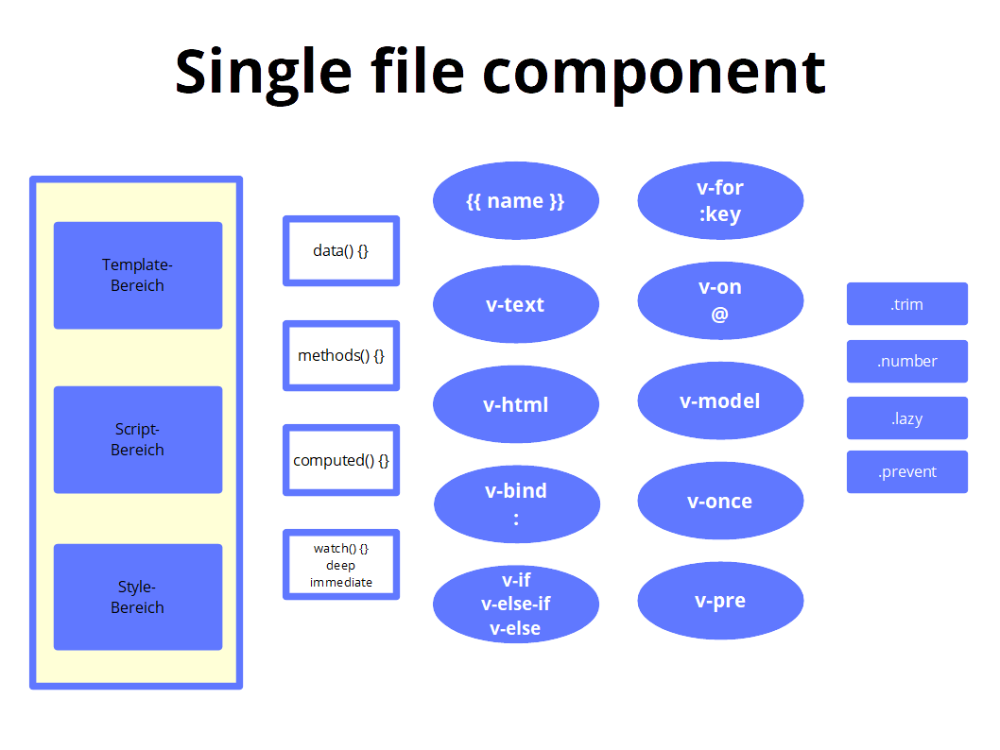

# Single File Components

## Text Binding

### 1. Beispiel

#### App.vue

```js
<template>
  <div class="container px-6 py-16 prose">
    <h1>
      Text Binding
    </h1>
    <div>Autor: {{ author }}</div>
  </div>
</template>
<script>
export default {
  name: "App",
  //
  data() {
    return {
      author: "Oliver Reinking",
    };
  },
};
</script>
```

### 2. Beispiel

#### App.vue

```js
<template>
  <div class="container px-6 py-16 prose">
    <h1>
      Text Binding
    </h1>
    <div>Der Autor {{ author }} hat das Buch {{ book }} geschrieben.</div>
  </div>
</template>
<script>
export default {
  name: "App",
  //
  data() {
    return {
      author: "Oliver Reinking",
      book: "Vue 3",
    };
  },
};
</script>
```

### 3. Beispiel

#### App.vue

```js
<template>
  <div class="container px-6 py-16 prose">
    <h1>
      Text Binding
    </h1>
    <div>
      Der Autor <span v-text="author"></span> hat das Buch
      <span v-text="book"></span> geschrieben.
    </div>
  </div>
</template>
<script>
export default {
  name: "App",
  //
  data() {
    return {
      author: "Oliver Reinking",
      book: "Vue 3",
    };
  },
};
</script>
```

## Binding HTML

### 1. Beispiel

#### App.vue

```js
<template>
  <div class="container px-6 py-16 prose">
    <h1>
      HTML Binding
    </h1>
    <div>
      Der Autor {{ author }} hat das Buch {{ book }} geschrieben.
    </div>
    <div>
      <span v-html="description"></span>
    </div>
  </div>
</template>
<script>
export default {
  name: "App",
  //
  data() {
    return {
      author: "Reinking",
      book: "Vue 3",
      description: "Eine Einführung in das JavaScript-Framework <b>VUE 3</b>",
    };
  },
};
</script>
```

### 2. Beispiel

#### App.vue

```js
<template>
  <div class="container px-6 py-16 prose">
    <h1>
      Cross-Side-Scripting
    </h1>
    <div>Der Autor {{ author }} hat das Buch {{ book }} geschrieben.</div>
    <div>Die Beschreibung lautet: <span v-html="description"></span></div>
    <div v-html="xss"></div>
  </div>
</template>
<script>
export default {
  name: "App",
  //
  data() {
    return {
      author: "Reinking",
      book: "Vue 3",
      description: "Eine Einführung in das JavaScript-Framework <b>VUE 3</b>",
      xss: `<a href='#' onclick="alert('Tja, das ist ein Hack, oder?')">Gewinnen Sie jetzt!</a>`,
    };
  },
};
</script>
```

## Binding to Attributes

### 1. Beispiel

#### App.vue

```js
<template>
  <div class="container px-6 py-16 prose">
    <h1 v-bind:id="headingId">
      Binding to Attributes
    </h1>
  </div>
</template>
<script>
export default {
  name: "App",
  //
  data() {
    return {
      headingId: "VUE3",
    };
  },
};
</script>
```

### 2. Beispiel

#### App.vue

```js
<template>
  <div class="container px-6 py-16 prose">
    <h1 v-bind:id="headingId">
      Binding to Attributes
    </h1>
    <button v-bind:disabled="isDisabled" class="btn">
      Button und das Attribut disabled
    </button>
  </div>
</template>
<script>
export default {
  name: "App",
  //
  data() {
    return {
      headingId: "VUE3",
      isDisabled: true,
    };
  },
};
</script>
```

## Binding Classes

### 1. Beispiel

#### App.vue

```js
<template>
  <div class="container px-6 py-16 prose">
    <h1 class="underline">
      Binding Classes
    </h1>
  </div>
</template>
<script>
export default {
  name: "App",
};
</script>
<style>
.underline {
  text-decoration: underline;
}
</style>
```

### 2. Beispiel

#### App.vue

```js
<template>
  <div class="container px-6 py-16">
    <h1 class="underline">
      Binding Classes
    </h1>
    <h2 class="underline" v-bind:class="status">Status</h2>
  </div>
</template>
<script>
export default {
  name: "App",
  //
  data() {
    return {
      status: 'success'
    };
  },
};
</script>
<style scoped>
.underline {
  text-decoration: underline;
}
.success {
  background-color: greenyellow;
  color: green;
}
</style>
```

### 3. Beispiel

#### App.vue

```js
<template>
  <div class="container px-6 py-16">
    <h1 class="underline">
      Binding Classes
    </h1>
    <h2 class="underline" v-bind:class="status">Status</h2>
    <h3 v-bind:class="{ especially: IsEspecially }">
      Ist dies ein besonderer Text?
    </h3>
  </div>
</template>
<script>
export default {
  name: "App",
  //
  data() {
    return {
      status: "success",
      IsEspecially: true,
    };
  },
};
</script>
<style scoped>
.underline {
  text-decoration: underline;
}
.especially {
  font-weight: 800;
  font-style: italic;
}
</style>
```

### 4. Beispiel

#### App.vue

```js
<template>
  <div class="container px-6 py-16">
    <h1 class="underline">
      Binding Classes
    </h1>
    <h2 class="underline" v-bind:class="status">Status</h2>
    <h3 v-bind:class="IsEspecially ? 'especially' : 'normal'">
      Ist dies ein besonderer Text?
    </h3>
  </div>
</template>
<script>
export default {
  name: "App",
  //
  data() {
    return {
      status: "success",
      IsEspecially: false,
    };
  },
};
</script>
<style scoped>
.underline {
  text-decoration: underline;
}
.success {
  background-color: greenyellow;
  color: green;
}
.especially {
  font-weight: 800;
  font-style: italic;
}
.normal {
  color: blue;
}
</style>

```

### 5. Beispiel

#### App.vue

```js
<template>
  <div class="container px-6 py-16">
    <h1 class="underline">
      Binding Classes
    </h1>
    <h2 class="underline" v-bind:class="status">Status</h2>
    <h3 v-bind:class="IsEspecially ? 'especially' : 'normal'">
      Ist dies ein besonderer Text?
    </h3>
    <h4
      v-bind:class="[
        'underline',
        IsEspecially && IsBold
          ? 'especially_bold'
          : IsEspecially && !IsBold
          ? 'especially'
          : IsBold
          ? 'only_bold'
          : '',
      ]"
    >
      Ein Array mit mehreren Klassen?
    </h4>
  </div>
</template>
<script>
export default {
  name: "App",
  //
  data() {
    return {
      status: "success",
      IsEspecially: false,
      IsBold: true,
    };
  },
};
</script>
<style scoped>
.underline {
  text-decoration: underline;
}
.danger {
  background-color: orangered;
  color: black;
}
.success {
  background-color: greenyellow;
  color: green;
}
.especially {
  font-weight: 100;
  font-style: italic;
}
.especially_bold {
  font-weight: 800;
  color: orange;
  font-style: italic;
}
.only_bold {
  font-weight: 800;
}
.normal {
  color: blue;
}
</style>
```

### 6. Beispiel

#### App.vue

```js
<template>
  <div class="container px-6 py-16">
    <h1 class="underline">
      Binding Classes
    </h1>
    <h2 class="underline" v-bind:class="status">Status</h2>
    <h3 v-bind:class="IsEspecially ? 'especially' : 'normal'">
      Ist dies ein besonderer Text?
    </h3>
    <h4
      v-bind:class="{
        underline: true,
        especially_bold: IsEspecially && IsBold,
        especially: IsEspecially && !IsBold,
        only_bold: !IsEspecially && IsBold,
      }"
    >
      Ein Objekt mit mehreren Klassen?
    </h4>
  </div>
</template>
<script>
export default {
  name: "App",
  //
  data() {
    return {
      status: "success",
      IsEspecially: false,
      IsBold: false,
    };
  },
};
</script>
<style scoped>
.underline {
  text-decoration: underline;
}
.danger {
  background-color: orangered;
  color: black;
}
.success {
  background-color: greenyellow;
  color: green;
}
.especially {
  font-weight: 100;
  font-style: italic;
}
.especially_bold {
  font-weight: 800;
  color: orange;
  font-style: italic;
}
.only_bold {
  font-weight: 800;
}
.normal {
  color: blue;
}
</style>
```

## Binding Styles

### 1. Beispiel

#### App.vue

```js
<template>
  <div class="container px-6 py-16 prose">
    <h1>
      Binding Styles
    </h1>
    <div
      v-bind:style="{
        color: highlightColor,
      }"
    >
      Inline Style
    </div>
  </div>
</template>
<script>
export default {
  name: "App",
  //
  data() {
    return {
      highlightColor: "#4FC08D",
    };
  },
};
</script>
```

### 2. Beispiel

#### App.vue

```js
<template>
  <div class="container px-6 py-16 prose">
    <h1>
      Binding Styles
    </h1>
    <div
      v-bind:style="{
        color: highlightColor,
        'font-size': divSize + 'px',
      }"
    >
      Inline Style
    </div>
  </div>
</template>
<script>
export default {
  name: "App",
  //
  data() {
    return {
      highlightColor: "#4FC08D",
      divSize: "50",
    };
  },
};
</script>
```

### 3. Beispiel

#### App.vue

```js
<template>
  <div class="container px-6 py-16 prose">
    <h1>
      Binding Styles
    </h1>
    <div
      v-bind:style="{
        color: highlightColor,
        fontSize: divSize + 'px',
        padding: '20px'
      }"
    >
      Inline Style
    </div>
  </div>
</template>
<script>
export default {
  name: "App",
  //
  data() {
    return {
      highlightColor: "#4FC08D",
      divSize: '50'
    };
  },
};
</script>
```

### 4. Beispiel

#### App.vue

```js
<template>
  <div class="container px-6 py-16 prose">
    <h1>
      Binding Styles
    </h1>
    <div v-bind:style="divStyleObject">
      Inline Style
    </div>
  </div>
</template>
<script>
export default {
  name: "App",
  //
  data() {
    return {
      divStyleObject: {
        color: "orange",
        fontSize: "50px",
        padding: "2px",
      },
    };
  },
};
</script>
```

### 5. Beispiel

#### App.vue

```js
<template>
  <div class="container px-6 py-16 prose">
    <h1>
      Binding Styles
    </h1>
    <div v-bind:style="[baseStyleObject, successStyleObject]">
      baseStyleObject und successStyleObject
    </div>
  </div>
</template>
<script>
export default {
  name: "App",
  //
  data() {
    return {
      baseStyleObject: {
        fontSize: "20px",
        padding: "2px",
      },
      successStyleObject: {
        color: "green",
        backgroundColor: "lightblue",
        border: "1 px solid",
      },
    };
  },
};
</script>
```

## Conditional Rendering

### 1. Beispiel

#### App.vue

```js
<template>
  <div class="container px-6 py-16 prose">
    <h1>
      Conditional Rendering
    </h1>
    <div v-if="inzidenzWert > 165" style="backgroundColor: red; color: white">
      Die Inzidenz liegt über 165!
    </div>
    <div
      v-else-if="inzidenzWert > 100 && inzidenzWert < 165"
      style="backgroundColor: orange; color: white"
    >
      Die Inzidenz liegt über 100, aber unter 165!
    </div>
    <div
      v-else-if="inzidenzWert > 50 && inzidenzWert < 100"
      style="backgroundColor: yellow; color: black"
    >
      Die Inzidenz liegt über 50, aber unter 100!
    </div>
    <div v-else style="backgroundColor: green; color: white">
      Die Inzidenz liegt unter 50!
    </div>
  </div>
</template>
<script>
export default {
  name: "App",
  //
  data() {
    return {
      inzidenzWert: 75,
    };
  },
};
</script>
```

### 2. Beispiel

#### App.vue

```js
<template>
  <div class="container px-6 py-16 prose">
    <h1>
      Conditional Rendering
    </h1>
    <div v-if="display === true">
      <h2>VUE 3</h2>
      <h2>Tailwindcss</h2>
      <h2>daisyUI</h2>
    </div>
  </div>
</template>
<script>
export default {
  name: "App",
  //
  data() {
    return {
      display: true,
    };
  },
};
</script>
```

### 3. Beispiel

#### App.vue

```js
<template>
  <div class="container px-6 py-16 prose">
    <h1>
      Conditional Rendering
    </h1>
    <div v-show="display">
      Offensichtlich ist display true.
    </div>
  </div>
</template>
<script>
export default {
  name: "App",
  //
  data() {
    return {
      display: true,
    };
  },
};
</script>
```

## List Rendering

### 1. Beispiel

#### App.vue

```js
<template>
  <div class="container px-6 py-16 prose">
    <h1>
      List Rendering
    </h1>
    <h2 v-for="name in names" :key="name">
      {{ name}}
    </h2>
  </div>
</template>
<script>
export default {
  name: "App",
  //
  data() {
    return {
      names: [
        'Vue 3',
        'Tailwindcss',
        'daisyUI'
      ]
    };
  },
};
</script>
```

### 2. Beispiel

#### App.vue

```js
<template>
  <div class="container px-6 py-16 prose">
    <h1>
      List Rendering
    </h1>
    <h2 v-for="(name, index) in names" :key="index">
      {{ name}}, {{ index }}
    </h2>
  </div>
</template>
<script>
export default {
  name: "App",
  //
  data() {
    return {
      names: [
        'Vue 3',
        'Tailwindcss',
        'daisyUI'
      ]
    };
  },
};
</script>
```

### 3. Beispiel

#### App.vue

```js
<template>
  <div class="container px-6 py-16 prose">
    <h1>
      List Rendering
    </h1>
    <h2 v-for="(fullName, index) in fullNames" :key="index">
      {{ fullName.name }} - {{ fullName.description }}
    </h2>
  </div>
</template>
<script>
export default {
  name: "App",
  //
  data() {
    return {
      fullNames: [
        { name: "VUE 3", description: "JavaScript-Framework" },
        { name: "tailwindcss", description: "CSS-Framework" },
        { name: "daisyUI", description: "tailwindcss-Erweiterung" },
      ],
    };
  },
};
</script>
```

### 4. Beispiel

#### App.vue

```js
<template>
  <div class="container px-6 py-16 prose">
    <h1>
      List Rendering
    </h1>
    <template v-for="(framework, index) in frameworks" :key="index">
      <h3>{{ framework.name }}</h3>
      <h4>Liste der Plugins</h4>
      <h5 v-for="(plugin, index) in framework.plugins" :key="index">
        {{ plugin }}
      </h5>
    </template>
  </div>
</template>
<script>
export default {
  name: "App",
  //
  data() {
    return {
      frameworks: [
        {
          name: "VUE 3",
          plugins: ["vuex", "vue-router", "vuetify"],
        },
        {
          name: "tailwindcss",
          plugins: ["daisyUI", "@tailwindcss/typography"],
        },
      ],
    };
  },
};
</script>
```

### 5. Beispiel

#### App.vue

```js
<template>
  <div class="container px-6 py-16 prose">
    <h1>
      List Rendering
    </h1>
    <template v-for="(item, key) in listFrameworks" :key="key">
      <h3>{{ key }}: {{ item }}</h3>
    </template>
  </div>
</template>
<script>
export default {
  name: "App",
  //
  data() {
    return {
      listFrameworks: {
        name: "VUE 3",
        description: "JavaScript-Framework",
        language: "JavaScript",
      },
    };
  },
};
</script>
```

### 6. Beispiel

#### App.vue

```js
<template>
  <div class="container px-6 py-16 prose">
    <h1>
      List Rendering
    </h1>
    <template v-for="(item, key, index) in listFrameworks" :key="index">
      <h3>{{ key }}: {{ item }} ({{index}})</h3>
    </template>
  </div>
</template>
<script>
export default {
  name: "App",
  //
  data() {
    return {
      listFrameworks: {
        name: "VUE 3",
        description: "JavaScript-Framework",
        language: "JavaScript",
      },
    };
  },
};
</script>
```

## Lists and Keys

### 1. Beispiel

#### App.vue

```js
<template>
  <div class="container px-6 py-16 prose">
    <h1>
      Lists and Keys
    </h1>
    <div v-for="name in names">
      <h5>{{ name }}</h5>
      <input placeholder="Nachname" />
    </div>
    <button class="mt-6 btn btn-primary" v-on:click="changeOrder">
      Liste neu sortieren
    </button>
  </div>
</template>
<script>
import _ from "lodash";
export default {
  name: "App",
  //
  data() {
    return {
      names: ["Angela", "Armin", "Annalena", "Olaf"],
    };
  },
  //
  methods: {
    changeOrder() {
      console.log(this.names);
      this.names = _.shuffle(this.names);
    },
  },
};
</script>
```

## Conditional List Rendering

### 1. Beispiel

#### App.vue

```js
<template>
  <div class="container px-6 py-16 prose">
    <h1>
      Conditional List Rendering
    </h1>
    <template v-for="name in names" :key="name">
      <h5 v-if="name === 'Annalena'">{{ name }}</h5>
    </template>
  </div>
</template>
<script>
export default {
  name: "App",
  //
  data() {
    return {
      names: ["Olaf", "Armin", "Annalena"],
    };
  },
};
</script>
```

## Methods

### 1. Beispiel

#### App.vue

```js
<template>
  <div class="container px-6 py-16 prose">
    <h1>
      Methods
    </h1>
    <h4>Summe von 1 + 2 + 3 + 4 + 5 + 6 = {{ add() }}</h4>
  </div>
</template>
<script>
export default {
  name: "App",
  //
  methods: {
    add() {
      return 1 + 2 + 3 + 4 + 5 + 6;
    },
  },
};
</script>
```

### 2. Beispiel

#### App.vue

```js
<template>
  <div class="container px-6 py-16 prose">
    <h1>
      Methods
    </h1>
    <h4>Summe von 1 + 2 + 3 + 4 + 5 + 6 = {{ add(1, 2, 3, 4, 5, 6) }}</h4>
    <h4>Summe von 1 + 2 + 3 + 5 + 8 + 13 = {{ add(1, 2, 3, 5, 8, 13) }}</h4>
  </div>
</template>
<script>
export default {
  name: "App",
  //
  methods: {
    add(a, b, c, d, e, f) {
      return a + b + c + d + e + f;
    },
  },
};
</script>
```

### 3. Beispiel

#### App.vue

```js
<template>
  <div class="container px-6 py-16 prose">
    <h1>
      Methods
    </h1>
    <h4>
      Multipliziere die Variable price mit dem normalen Mehrwertsteuersatz:
    </h4>
    <div>
      Steuersatz: {{ taxRate }}
      <br />
      Netto-Preis: {{ price }}
      <br />
      Brutto-Preis: {{ multiply(price) }}
    </div>
  </div>
</template>
<script>
export default {
  name: "App",
  //
  data() {
    return {
      price: 100,
      taxRate: 19,
    };
  },
  //
  methods: {
    multiply(num) {
      return (num * (100 + this.taxRate) / 100);
    },
  },
};
</script>

```

## Event Handling

### 1. Beispiel

#### App.vue

```js
<template>
  <div class="container px-6 py-16 prose">
    <h1>
      Event Handling
    </h1>
    <h5>{{ name }}</h5>
    <div class="mt-8">
      <button v-on:click="name = 'Annalena'" class="btn btn-sm btn-primary">
        Ändere den Namen
      </button>
    </div>
  </div>
</template>
<script>
export default {
  name: "App",
  //
  data() {
    return {
      name: "Angela",
    };
  },
};
</script>
```

### 2. Beispiel

#### App.vue

```js
<template>
  <div class="container px-6 py-16 prose">
    <h1>
      Event Handling
    </h1>
    <h5>{{ count }}</h5>
    <div class="mt-8 btn-group">
      <button v-on:click="count += 1" class="btn btn-sm btn-primary">
        Plus
      </button>
      <button v-on:click="count += -1" class="btn btn-sm btn-secondary">
        Minus
      </button>
    </div>
  </div>
</template>
<script>
export default {
  name: "App",
  //
  data() {
    return {
      count: 0,
    };
  },
};
</script>
```

### 3. Beispiel

#### App.vue

```js
<template>
  <div class="container px-6 py-16 prose">
    <h1>
      Event Handling
    </h1>
    <h5>{{ count }}</h5>
    <div class="mt-8 btn-group">
      <button v-on:click="changeCount(1)" class="btn btn-sm btn-primary">
        Plus
      </button>
      <button v-on:click="changeCount(-1)" class="btn btn-sm btn-secondary">
        Minus
      </button>
    </div>
  </div>
</template>
<script>
export default {
  name: "App",
  //
  data() {
    return {
      count: 0,
    };
  },
  //
  methods: {
    changeCount(value) {
      this.count = this.count + value;
    },
  },
};
</script>
```

### 4. Beispiel

#### App.vue

```js
<template>
  <div class="container px-6 py-16 prose">
    <h1>
      Event Handling
    </h1>
    <h5>{{ count }}</h5>
    <div class="mt-8 btn-group">
      <button v-on:click="changeCount(1)" class="btn btn-sm btn-primary">
        Plus 1
      </button>
      <button v-on:click="changeCount(5)" class="btn btn-sm btn-primary">
        Plus 5
      </button>
      <button v-on:click="changeCount(-1)" class="btn btn-sm btn-secondary">
        Minus 1
      </button>
      <button v-on:click="changeCount(-5)" class="btn btn-sm btn-secondary">
        Minus 5
      </button>
    </div>
  </div>
</template>
<script>
export default {
  name: "App",
  //
  data() {
    return {
      count: 0,
    };
  },
  //
  methods: {
    changeCount(value) {
      this.count = this.count + value;
    },
  },
};
</script>
```

### 5. Beispiel

#### App.vue

```js
<template>
  <div class="container px-6 py-16 prose">
    <h1>
      Event Handling
    </h1>
    <h5>{{ count }}</h5>
    <div class="mt-8 btn-group">
      <button v-on:click="changeCount(1, $event)" class="btn btn-sm btn-primary">
        Plus 1
      </button>
      <button v-on:click="changeCount(5, $event)" class="btn btn-sm btn-primary">
        Plus 5
      </button>
      <button v-on:click="changeCount(-1, $event)" class="btn btn-sm btn-secondary">
        Minus 1
      </button>
      <button v-on:click="changeCount(-5, $event)" class="btn btn-sm btn-secondary">
        Minus 5
      </button>
    </div>
  </div>
</template>
<script>
export default {
  name: "App",
  //
  data() {
    return {
      count: 0,
    };
  },
  //
  methods: {
    changeCount(value, event) {
      console.log("event: ", event);
      this.count = this.count + value;
    },
  },
};
</script>
```

### 6. Beispiel

#### App.vue

```js
<template>
  <div class="container px-6 py-16 prose">
    <h1>
      Event Handling
    </h1>
    <h5>{{ name }} {{ lastName }} </h5>
    <h5>{{ count }}</h5>
    <div class="mt-8 btn-group">
      <button
        v-on:click="changeName($event), changeCount(1, $event)"
        class="btn btn-sm btn-primary"
      >
        Plus 1
      </button>
      <button
        v-on:click="changeCount(5, $event)"
        class="btn btn-sm btn-primary"
      >
        Plus 5
      </button>
      <button
        v-on:click="changeCount(-1, $event)"
        class="btn btn-sm btn-secondary"
      >
        Minus 1
      </button>
      <button
        v-on:click="changeCount(-5, $event)"
        class="btn btn-sm btn-secondary"
      >
        Minus 5
      </button>
    </div>
  </div>
</template>
<script>
export default {
  name: "App",
  //
  data() {
    return {
      name: "Angela",
      lastName: "Merkel",
      count: 0,
    };
  },
  //
  methods: {
    changeName(event) {
      console.log("changeName: ", event);
      this.name = "Annalena";
    },
    changeCount(value, event) {
      console.log("changeCount: ", event);
      this.count = this.count + value;
    },
  },
};
</script>
```

## Form Handling

### 1. Beispiel

#### App.vue

```js
<template>
  <div class="container px-6 py-16 prose">
    <h1>
      Form Handling
    </h1>
    <h2>Eingabebereich</h2>
    <form>
      <div class="p-2 flex flex-wrap items-center justify-between -mx-4">
        <div class="form-control w-1/2 px-4">
          <label class="label" for="firstName">
            <span class="label-text">Vorname</span>
          </label>
          <input
            type="text"
            id="firstName"
            v-model="form.firstName"
            placeholder="Vorname"
            class="input input-bordered"
          />
        </div>
        <div class="form-control w-1/2 px-4">
          <label class="label" vor="lastName">
            <span class="label-text">Nachname</span>
          </label>
          <input
            type="text"
            id="lastName"
            v-model="form.lastName"
            placeholder="Nachname"
            class="input input-bordered"
          />
        </div>
      </div>
    </form>
    <h2>Ausgabebereich</h2>
    <div class="p-2 shadow-lg bg-gray-200 text-gray-900">
      <div v-for="(item, key, index) in form" :key="index">
        {{ key }}: {{ item }}
      </div>
    </div>
  </div>
</template>
<script>
export default {
  name: "App",
  //
  data() {
    return {
      form: {
        firstName: "Klaus",
        lastName: "Fischer",
      },
    };
  },
};
</script>
```

### 2. Beispiel

#### App.vue

```js
<template>
  <div class="container px-6 py-16 prose">
    <h1>
      Form Handling
    </h1>
    <h2>Eingabebereich</h2>
    <form>
      <div class="p-2 flex flex-wrap items-center justify-between -mx-4">
        <div class="form-control w-1/2 px-4">
          <label class="label" for="firstName">
            <span class="label-text">Vorname</span>
          </label>
          <input
            type="text"
            id="firstName"
            v-model="form.firstName"
            placeholder="Vorname"
            class="input input-bordered"
          />
        </div>
        <div class="form-control w-1/2 px-4">
          <label class="label" vor="lastName">
            <span class="label-text">Nachname</span>
          </label>
          <input
            type="text"
            id="lastName"
            v-model="form.lastName"
            placeholder="Nachname"
            class="input input-bordered"
          />
        </div>
        <div class="mt-4 form-control w-full px-4">
          <label class="label" for="hobbies">
            <span class="label-text">Hobbys</span>
          </label>
          <textarea
            id="hobbies"
            v-model="form.hobbies"
            placeholder="Deine Hobbys"
            class="textarea h-24 textarea textarea-bordered"
          />
        </div>
      </div>
    </form>
    <h2>Ausgabebereich</h2>
    <div class="p-2 shadow-lg bg-gray-200 text-gray-900">
      <div v-for="(item, key, index) in form" :key="index">
        {{ key }}: {{ item }}
      </div>
    </div>
  </div>
</template>
<script>
export default {
  name: "App",
  //
  data() {
    return {
      form: {
        firstName: "Klaus",
        lastName: "Fischer",
        hobbies: "Fußball, Tor des Monats",
      },
    };
  },
};
</script>
```

### 3. Beispiel

#### App.vue

```js
<template>
  <div class="container px-6 py-16 prose">
    <h1>
      Form Handling
    </h1>
    <h2>Eingabebereich</h2>
    <form>
      <div class="p-2 flex flex-wrap items-center justify-between -mx-4">
        <div class="form-control w-1/2 px-4">
          <label class="label" for="firstName">
            <span class="label-text">Vorname</span>
          </label>
          <input
            type="text"
            id="firstName"
            v-model="form.firstName"
            placeholder="Vorname"
            class="input input-bordered"
          />
        </div>
        <div class="form-control w-1/2 px-4">
          <label class="label" vor="lastName">
            <span class="label-text">Nachname</span>
          </label>
          <input
            type="text"
            id="lastName"
            v-model="form.lastName"
            placeholder="Nachname"
            class="input input-bordered"
          />
        </div>
        <div class="mt-4 form-control w-full px-4">
          <label class="label" for="hobbies">
            <span class="label-text">Hobbys</span>
          </label>
          <textarea
            id="hobbies"
            v-model="form.hobbies"
            placeholder="Deine Hobbys"
            class="textarea h-24 textarea textarea-bordered"
          />
        </div>
        <div class="mt-4 form-control w-full px-4">
          <label class="label" for="color">
            <span class="label-text">Lieblingsfarbe</span>
          </label>
          <select
            id="color"
            class="select select-bordered w-full"
            v-model="form.color"
          >
            <option value="">Wähle Deine Lieblingsfarbe</option>
            <option value="blue">blau</option>
            <option value="red">rot</option>
            <option value="green">grün</option>
          </select>
        </div>
      </div>
    </form>
    <h2>Ausgabebereich</h2>
    <div class="p-2 shadow-lg bg-gray-200 text-gray-900">
      <div v-for="(item, key, index) in form" :key="index">
        {{ key }}: {{ item }}
      </div>
    </div>
  </div>
</template>
<script>
export default {
  name: "App",
  //
  data() {
    return {
      form: {
        firstName: "Klaus",
        lastName: "Fischer",
        hobbies: "Fußball, Tor des Monats",
        color: "blue",
      },
    };
  },
};
</script>
```

### 4. Beispiel

#### App.vue

```js
<template>
  <div class="container px-6 py-16 prose">
    <h1>
      Form Handling
    </h1>
    <h2>Eingabebereich</h2>
    <form>
      <div class="p-2 flex flex-wrap items-center justify-between -mx-4">
        <div class="form-control w-1/2 px-4">
          <label class="label" for="firstName">
            <span class="label-text">Vorname</span>
          </label>
          <input
            type="text"
            id="firstName"
            v-model="form.firstName"
            placeholder="Vorname"
            class="input input-bordered"
          />
        </div>
        <div class="form-control w-1/2 px-4">
          <label class="label" vor="lastName">
            <span class="label-text">Nachname</span>
          </label>
          <input
            type="text"
            id="lastName"
            v-model="form.lastName"
            placeholder="Nachname"
            class="input input-bordered"
          />
        </div>
        <div class="mt-4 form-control w-full px-4">
          <label class="label" for="hobbies">
            <span class="label-text">Hobbys</span>
          </label>
          <textarea
            id="hobbies"
            v-model="form.hobbies"
            placeholder="Deine Hobbys"
            class="textarea h-24 textarea textarea-bordered"
          />
        </div>
        <div class="mt-4 form-control w-full px-4">
          <label class="label" for="color">
            <span class="label-text">Lieblingsfarbe</span>
          </label>
          <select
            id="color"
            class="select select-bordered w-full"
            v-model="form.color"
          >
            <option value="">Wähle Deine Lieblingsfarbe</option>
            <option value="blue">blau</option>
            <option value="red">rot</option>
            <option value="green">grün</option>
          </select>
        </div>
        <div class="mt-4 form-control w-full px-4">
          <label class="label" for="favoriteClubs">
            <span class="label-text">Lieblingsvereine</span>
          </label>
          <select
            id="color"
            class="select select-bordered w-full h-36"
            v-model="form.favoriteClubs"
            multiple
          >
            <option value="FC Schalke 04">FC Schalke 04</option>
            <option value="Borussia Dortmund">Borussia Dortmund</option>
            <option value="MSV Duisburg">MSV Duisburg</option>
            <option value="Rot-Weiss Essen">Rot-Weiss Essen</option>
          </select>
        </div>
      </div>
    </form>
    <h2>Ausgabebereich</h2>
    <div class="p-2 shadow-lg bg-gray-200 text-gray-900">
      <div v-for="(item, key, index) in form" :key="index">
        {{ key }}: {{ item }}
      </div>
    </div>
  </div>
</template>
<script>
export default {
  name: "App",
  //
  data() {
    return {
      form: {
        firstName: "Klaus",
        lastName: "Fischer",
        hobbies: "Fußball, Tor des Monats",
        color: "blue",
        favoriteClubs: ["FC Schalke 04"],
      },
    };
  },
};
</script>
```

### 5. Beispiel

#### App.vue

```js
<template>
  <div class="container px-6 py-16 prose">
    <h1>
      Form Handling
    </h1>
    <h2>Eingabebereich</h2>
    <form>
      <div class="p-2 flex flex-wrap items-center justify-between -mx-4">
        <div class="form-control w-1/2 px-4">
          <label class="label" for="firstName">
            <span class="label-text">Vorname</span>
          </label>
          <input
            type="text"
            id="firstName"
            v-model="form.firstName"
            placeholder="Vorname"
            class="input input-bordered"
          />
        </div>
        <div class="form-control w-1/2 px-4">
          <label class="label" vor="lastName">
            <span class="label-text">Nachname</span>
          </label>
          <input
            type="text"
            id="lastName"
            v-model="form.lastName"
            placeholder="Nachname"
            class="input input-bordered"
          />
        </div>
        <div class="mt-4 form-control w-full px-4">
          <label class="label" for="hobbies">
            <span class="label-text">Hobbys</span>
          </label>
          <textarea
            id="hobbies"
            v-model="form.hobbies"
            placeholder="Deine Hobbys"
            class="textarea h-24 textarea textarea-bordered"
          />
        </div>
        <div class="mt-4 form-control w-full px-4">
          <label class="label" for="color">
            <span class="label-text">Lieblingsfarbe</span>
          </label>
          <select
            id="color"
            class="select select-bordered w-full"
            v-model="form.color"
          >
            <option value="">Wähle Deine Lieblingsfarbe</option>
            <option value="blue">blau</option>
            <option value="red">rot</option>
            <option value="green">grün</option>
          </select>
        </div>
        <div class="mt-4 form-control w-full px-4">
          <label class="label" for="favoriteClubs">
            <span class="label-text">Lieblingsvereine</span>
          </label>
          <select
            id="color"
            class="select select-bordered w-full h-36"
            v-model="form.favoriteClubs"
            multiple
          >
            <option value="FC Schalke 04">FC Schalke 04</option>
            <option value="Borussia Dortmund">Borussia Dortmund</option>
            <option value="MSV Duisburg">MSV Duisburg</option>
            <option value="Rot-Weiss Essen">Rot-Weiss Essen</option>
          </select>
        </div>
        <div class="mt-4 form-control w-full px-4">
          <label class="cursor-pointer label justify-start">
            <div class="mr-2">
              <input
                type="checkbox"
                id="goal"
                v-model="form.goalOfTheMonth"
                class="checkbox"
              />
              <span class="checkbox-mark"></span>
            </div>
            <span class="label-text" for="goal"
              >Hast Du schon einmal das Tor des Monats geschossen?</span
            >
          </label>
        </div>
      </div>
    </form>
    <h2>Ausgabebereich</h2>
    <div class="p-2 shadow-lg bg-gray-200 text-gray-900">
      <div v-for="(item, key, index) in form" :key="index">
        {{ key }}: {{ item }}
      </div>
    </div>
  </div>
</template>
<script>
export default {
  name: "App",
  //
  data() {
    return {
      form: {
        firstName: "Klaus",
        lastName: "Fischer",
        hobbies: "Fußball, Tor des Monats",
        color: "blue",
        favoriteClubs: ["FC Schalke 04"],
        goalOfTheMonth: false,
      },
    };
  },
};
</script>
```

### 6. Beispiel

#### App.vue

```js
<template>
  <div class="container px-6 py-16 prose">
    <h1>
      Form Handling
    </h1>
    <h2>Eingabebereich</h2>
    <form>
      <div class="flex flex-wrap items-center justify-between -mx-4">
        <div class="form-control w-1/2 px-4">
          <label class="label" for="firstName">
            <span class="label-text">Vorname</span>
          </label>
          <input
            type="text"
            id="firstName"
            v-model="form.firstName"
            placeholder="Vorname"
            class="input input-bordered"
          />
        </div>
        <div class="form-control w-1/2 px-4">
          <label class="label" vor="lastName">
            <span class="label-text">Nachname</span>
          </label>
          <input
            type="text"
            id="lastName"
            v-model="form.lastName"
            placeholder="Nachname"
            class="input input-bordered"
          />
        </div>
        <div class="mt-4 form-control w-full px-4">
          <label class="label" for="hobbies">
            <span class="label-text">Hobbys</span>
          </label>
          <textarea
            id="hobbies"
            v-model="form.hobbies"
            placeholder="Deine Hobbys"
            class="textarea h-24 textarea textarea-bordered"
          />
        </div>
        <div class="mt-4 form-control w-full px-4">
          <label class="label" for="color">
            <span class="label-text">Lieblingsfarbe</span>
          </label>
          <select
            id="color"
            class="select select-bordered w-full"
            v-model="form.color"
          >
            <option value="">Wähle Deine Lieblingsfarbe</option>
            <option value="blue">blau</option>
            <option value="red">rot</option>
            <option value="green">grün</option>
          </select>
        </div>
        <div class="mt-4 form-control w-full px-4">
          <label class="label" for="favoriteClubs">
            <span class="label-text">Lieblingsvereine</span>
          </label>
          <select
            id="favoriteClubs"
            class="select select-bordered w-full h-36"
            v-model="form.favoriteClubs"
            multiple
          >
            <option value="FC Schalke 04">FC Schalke 04</option>
            <option value="Borussia Dortmund">Borussia Dortmund</option>
            <option value="MSV Duisburg">MSV Duisburg</option>
            <option value="Rot-Weiss Essen">Rot-Weiss Essen</option>
          </select>
        </div>
        <div class="mt-4 form-control w-full px-4">
          <label class="cursor-pointer label justify-start">
            <div class="mr-2">
              <input
                type="checkbox"
                id="goal"
                v-model="form.goalOfTheMonth"
                class="checkbox"
              />
              <span class="checkbox-mark"></span>
            </div>
            <span class="label-text" for="goal"
              >Hast Du schon einmal das Tor des Monats geschossen?</span
            >
          </label>
        </div>
        <div class="mt-4 form-control w-full px-4">
          <label class="label" for="favoriteClubs">
            <span class="label-text">Positionen?</span>
          </label>
          <label class="cursor-pointer label justify-start">
            <div class="mr-2">
              <input
                type="checkbox"
                id="centre-forward"
                v-model="form.positions"
                value="Mittelstürmer"
                class="checkbox"
              />
              <span class="checkbox-mark" for="centre-forward"></span>
            </div>
            <span class="label-text">Mittelstürmer</span>
          </label>
          <label class="cursor-pointer label justify-start">
            <div class="mr-2">
              <input
                type="checkbox"
                id="left-wing"
                v-model="form.positions"
                value="Linksaußen"
                class="checkbox"
              />
              <span class="checkbox-mark" for="left-wing"></span>
            </div>
            <span class="label-text">Linksaußen</span>
          </label>
          <label class="cursor-pointer label justify-start">
            <div class="mr-2">
              <input
                type="checkbox"
                id="right-wing"
                v-model="form.positions"
                value="Rechtsaußen"
                class="checkbox"
              />
              <span class="checkbox-mark" for="right-wing"></span>
            </div>
            <span class="label-text">Rechtsaußen</span>
          </label>
        </div>
      </div>
    </form>
    <h2>Ausgabebereich</h2>
    <div class="p-2 shadow-lg bg-gray-200 text-gray-900">
      <div v-for="(item, key, index) in form" :key="index">
        {{ key }}: {{ item }}
      </div>
    </div>
  </div>
</template>
<script>
export default {
  name: "App",
  //
  data() {
    return {
      form: {
        firstName: "Klaus",
        lastName: "Fischer",
        hobbies: "Fußball, Tor des Monats",
        color: "blue",
        favoriteClubs: ["FC Schalke 04"],
        goalOfTheMonth: false,
        positions: [],
      },
    };
  },
};
</script>
```

### 7. Beispiel

#### App.vue

```js
<template>
  <div class="container px-6 py-16 prose">
    <h1>
      Form Handling
    </h1>
    <h2>Eingabebereich</h2>
    <form>
      <div class="flex flex-wrap items-center justify-between -mx-4">
        <div class="form-control w-1/2 px-4">
          <label class="label" for="firstName">
            <span class="label-text">Vorname</span>
          </label>
          <input
            type="text"
            id="firstName"
            v-model="form.firstName"
            placeholder="Vorname"
            class="input input-bordered"
          />
        </div>
        <div class="form-control w-1/2 px-4">
          <label class="label" vor="lastName">
            <span class="label-text">Nachname</span>
          </label>
          <input
            type="text"
            id="lastName"
            v-model="form.lastName"
            placeholder="Nachname"
            class="input input-bordered"
          />
        </div>
        <div class="mt-4 form-control w-full px-4">
          <label class="label" for="hobbies">
            <span class="label-text">Hobbys</span>
          </label>
          <textarea
            id="hobbies"
            v-model="form.hobbies"
            placeholder="Deine Hobbys"
            class="textarea h-24 textarea textarea-bordered"
          />
        </div>
        <div class="mt-4 form-control w-full px-4">
          <label class="label" for="color">
            <span class="label-text">Lieblingsfarbe</span>
          </label>
          <select
            id="color"
            class="select select-bordered w-full"
            v-model="form.color"
          >
            <option value="">Wähle Deine Lieblingsfarbe</option>
            <option value="blue">blau</option>
            <option value="red">rot</option>
            <option value="green">grün</option>
          </select>
        </div>
        <div class="mt-4 form-control w-full px-4">
          <label class="label" for="favoriteClubs">
            <span class="label-text">Lieblingsvereine</span>
          </label>
          <select
            id="favoriteClubs"
            class="select select-bordered w-full h-36"
            v-model="form.favoriteClubs"
            multiple
          >
            <option value="FC Schalke 04">FC Schalke 04</option>
            <option value="Borussia Dortmund">Borussia Dortmund</option>
            <option value="MSV Duisburg">MSV Duisburg</option>
            <option value="Rot-Weiss Essen">Rot-Weiss Essen</option>
          </select>
        </div>
        <div class="mt-4 form-control w-full px-4">
          <label class="cursor-pointer label justify-start">
            <div class="mr-2">
              <input
                type="checkbox"
                id="goal"
                v-model="form.goalOfTheMonth"
                class="checkbox"
              />
              <span class="checkbox-mark"></span>
            </div>
            <span class="label-text" for="goal"
              >Hast Du schon einmal das Tor des Monats geschossen?</span
            >
          </label>
        </div>
        <div class="mt-4 form-control w-full px-4">
          <label class="label" for="favoriteClubs">
            <span class="label-text">Positionen?</span>
          </label>
          <label class="cursor-pointer label justify-start">
            <div class="mr-2">
              <input
                type="checkbox"
                id="centre-forward"
                v-model="form.positions"
                value="Mittelstürmer"
                class="checkbox"
              />
              <span class="checkbox-mark" for="centre-forward"></span>
            </div>
            <span class="label-text">Mittelstürmer</span>
          </label>
          <label class="cursor-pointer label justify-start">
            <div class="mr-2">
              <input
                type="checkbox"
                id="left-wing"
                v-model="form.positions"
                value="Linksaußen"
                class="checkbox"
              />
              <span class="checkbox-mark" for="left-wing"></span>
            </div>
            <span class="label-text">Linksaußen</span>
          </label>
          <label class="cursor-pointer label justify-start">
            <div class="mr-2">
              <input
                type="checkbox"
                id="right-wing"
                v-model="form.positions"
                value="Rechtsaußen"
                class="checkbox"
              />
              <span class="checkbox-mark" for="right-wing"></span>
            </div>
            <span class="label-text">Rechtsaußen</span>
          </label>
        </div>
        <div class="mt-4 form-control w-full px-4">
          <label class="label" for="favoriteClubs">
            <span class="label-text">restliche Vertragslaufzeit?</span>
          </label>
          <label class="cursor-pointer label justify-start">
            <div class="mr-2">
              <input
                type="radio"
                id="years1-2"
                v-model="form.yearsRemaining"
                value="1 bis 2 Jahre"
                class="radio"
              />
              <span class="radio-mark" for="years1-2"></span>
            </div>
            <span class="label-text">1 bis 2 Jahre</span>
          </label>
          <label class="cursor-pointer label justify-start">
            <div class="mr-2">
              <input
                type="radio"
                id="years3-4"
                v-model="form.yearsRemaining"
                value="3 bis 4 Jahre"
                class="radio"
              />
              <span class="radio-mark" for="years3-4"></span>
            </div>
            <span class="label-text">3 bis 4 Jahre</span>
          </label>
          <label class="cursor-pointer label justify-start">
            <div class="mr-2">
              <input
                type="radio"
                id="years5"
                v-model="form.yearsRemaining"
                value="mehr als 4 Jahre"
                class="radio"
              />
              <span class="radio-mark" for="year5"></span>
            </div>
            <span class="label-text">mehr als 4 Jahre</span>
          </label>
        </div>
      </div>
    </form>
    <h2>Ausgabebereich</h2>
    <div class="p-2 shadow-lg bg-gray-200 text-gray-900">
      <div v-for="(item, key, index) in form" :key="index">
        {{ key }}: {{ item }}
      </div>
    </div>
  </div>
</template>
<script>
export default {
  name: "App",
  //
  data() {
    return {
      form: {
        firstName: "Klaus",
        lastName: "Fischer",
        hobbies: "Fußball, Tor des Monats",
        color: "blue",
        favoriteClubs: ["FC Schalke 04"],
        goalOfTheMonth: false,
        positions: [],
        yearsRemaining: "",
      },
    };
  },
};
</script>
```

### 8. Beispiel

#### App.vue

```js
<template>
  <div class="container px-6 py-16 prose">
    <h1>
      Form Handling
    </h1>
    <h2>Eingabebereich</h2>
    <form v-on:submit="submitForm">
      <div class="flex flex-wrap items-center justify-between -mx-4">
        <div class="form-control w-1/2 px-4">
          <label class="label" for="firstName">
            <span class="label-text">Vorname</span>
          </label>
          <input
            type="text"
            id="firstName"
            v-model="form.firstName"
            placeholder="Vorname"
            class="input input-bordered"
          />
        </div>
        <div class="form-control w-1/2 px-4">
          <label class="label" vor="lastName">
            <span class="label-text">Nachname</span>
          </label>
          <input
            type="text"
            id="lastName"
            v-model="form.lastName"
            placeholder="Nachname"
            class="input input-bordered"
          />
        </div>
        <div class="mt-4 form-control w-full px-4">
          <label class="label" for="hobbies">
            <span class="label-text">Hobbys</span>
          </label>
          <textarea
            id="hobbies"
            v-model="form.hobbies"
            placeholder="Deine Hobbys"
            class="textarea h-24 textarea textarea-bordered"
          />
        </div>
        <div class="mt-4 form-control w-full px-4">
          <label class="label" for="color">
            <span class="label-text">Lieblingsfarbe</span>
          </label>
          <select
            id="color"
            class="select select-bordered w-full"
            v-model="form.color"
          >
            <option value="">Wähle Deine Lieblingsfarbe</option>
            <option value="blue">blau</option>
            <option value="red">rot</option>
            <option value="green">grün</option>
          </select>
        </div>
        <div class="mt-4 form-control w-full px-4">
          <label class="label" for="favoriteClubs">
            <span class="label-text">Lieblingsvereine</span>
          </label>
          <select
            id="favoriteClubs"
            class="select select-bordered w-full h-36"
            v-model="form.favoriteClubs"
            multiple
          >
            <option value="FC Schalke 04">FC Schalke 04</option>
            <option value="Borussia Dortmund">Borussia Dortmund</option>
            <option value="MSV Duisburg">MSV Duisburg</option>
            <option value="Rot-Weiss Essen">Rot-Weiss Essen</option>
          </select>
        </div>
        <div class="mt-4 form-control w-full px-4">
          <label class="cursor-pointer label justify-start">
            <div class="mr-2">
              <input
                type="checkbox"
                id="goal"
                v-model="form.goalOfTheMonth"
                class="checkbox"
              />
              <span class="checkbox-mark"></span>
            </div>
            <span class="label-text" for="goal"
              >Hast Du schon einmal das Tor des Monats geschossen?</span
            >
          </label>
        </div>
        <div class="mt-4 form-control w-full px-4">
          <label class="label" for="favoriteClubs">
            <span class="label-text">Positionen?</span>
          </label>
          <label class="cursor-pointer label justify-start">
            <div class="mr-2">
              <input
                type="checkbox"
                id="centre-forward"
                v-model="form.positions"
                value="Mittelstürmer"
                class="checkbox"
              />
              <span class="checkbox-mark" for="centre-forward"></span>
            </div>
            <span class="label-text">Mittelstürmer</span>
          </label>
          <label class="cursor-pointer label justify-start">
            <div class="mr-2">
              <input
                type="checkbox"
                id="left-wing"
                v-model="form.positions"
                value="Linksaußen"
                class="checkbox"
              />
              <span class="checkbox-mark" for="left-wing"></span>
            </div>
            <span class="label-text">Linksaußen</span>
          </label>
          <label class="cursor-pointer label justify-start">
            <div class="mr-2">
              <input
                type="checkbox"
                id="right-wing"
                v-model="form.positions"
                value="Rechtsaußen"
                class="checkbox"
              />
              <span class="checkbox-mark" for="right-wing"></span>
            </div>
            <span class="label-text">Rechtsaußen</span>
          </label>
        </div>
        <div class="mt-4 form-control w-full px-4">
          <label class="label" for="favoriteClubs">
            <span class="label-text">restliche Vertragslaufzeit?</span>
          </label>
          <label class="cursor-pointer label justify-start">
            <div class="mr-2">
              <input
                type="radio"
                id="years1-2"
                v-model="form.yearsRemaining"
                value="1 bis 2 Jahre"
                class="radio"
              />
              <span class="radio-mark" for="years1-2"></span>
            </div>
            <span class="label-text">1 bis 2 Jahre</span>
          </label>
          <label class="cursor-pointer label justify-start">
            <div class="mr-2">
              <input
                type="radio"
                id="years3-4"
                v-model="form.yearsRemaining"
                value="3 bis 4 Jahre"
                class="radio"
              />
              <span class="radio-mark" for="years3-4"></span>
            </div>
            <span class="label-text">3 bis 4 Jahre</span>
          </label>
          <label class="cursor-pointer label justify-start">
            <div class="mr-2">
              <input
                type="radio"
                id="years5"
                v-model="form.yearsRemaining"
                value="mehr als 4 Jahre"
                class="radio"
              />
              <span class="radio-mark" for="year5"></span>
            </div>
            <span class="label-text">mehr als 4 Jahre</span>
          </label>
        </div>
      </div>
      <div>
        <button class="btn btn-sm btn-primary">Daten übermitteln</button>
      </div>
    </form>
    <h2>Ausgabebereich</h2>
    <div class="p-2 shadow-lg bg-gray-200 text-gray-900">
      <div v-for="(item, key, index) in form" :key="index">
        {{ key }}: {{ item }}
      </div>
    </div>
  </div>
</template>
<script>
export default {
  name: "App",
  //
  data() {
    return {
      form: {
        firstName: "Klaus",
        lastName: "Fischer",
        hobbies: "Fußball, Tor des Monats",
        color: "blue",
        favoriteClubs: ["FC Schalke 04"],
        goalOfTheMonth: false,
        positions: [],
        yearsRemaining: "",
      },
    };
  },
  //
  methods: {
    submitForm(event) {
      event.preventDefault();
      console.log("Form data: ", this.form);
    },
  },
};
</script>
```

## Modifiers

### 1. Beispiel

```js
<input
  type="text"
  id="firstName"
  v-model.trim="form.firstName"
  placeholder="Vorname"
  class="input input-bordered"
/>
```

### 2. Beispiel

#### App.vue

```js
<template>
  <div class="container px-6 py-16 prose">
    <h1>
      Modifiers
    </h1>
    <h2>Eingabebereich</h2>
    <form v-on:submit="submitForm">
      <div class="p-2 flex flex-wrap items-center justify-between -mx-2">
        <div class="form-control w-1/2 px-2">
          <label class="label" for="age">
            <span class="label-text">Alter in Jahren</span>
          </label>
          <input
            type="text"
            id="age"
            v-model.number="form.age"
            class="input input-bordered"
          />
        </div>
      </div>
      <div>
        <button class="btn btn-sm btn-primary">Daten übermitteln</button>
      </div>
    </form>
    <h2>Ausgabebereich</h2>
    <div class="p-2 shadow-lg bg-gray-200 text-gray-900">
      <div v-for="(item, key, index) in form" :key="index">
        {{ key }}: {{ item }}
      </div>
    </div>
  </div>
</template>
<script>
export default {
  name: "App",
  //
  data() {
    return {
      form: {
        age: null,
      },
    };
  },
  //
  methods: {
    submitForm(event) {
      event.preventDefault();
      console.log('Form data: ', this.form);
    }
  }
};
</script>
```

### 3. Beispiel

#### App.vue

```js
<input
  type="text"
  id="age"
  v-model.number.lazy="form.age"
  class="input input-bordered"
/>
```

### 4. Beispiel

#### App.vue

```js
<template>
  <div class="container px-6 py-16 prose">
    <h1>
      Modifiers
    </h1>
    <h2>Eingabebereich</h2>
    <form v-on:submit.prevent="submitForm">
      <div class="p-2 flex flex-wrap items-center justify-between -mx-2">
        <div class="form-control w-1/2 px-2">
          <label class="label" for="age">
            <span class="label-text">Alter in Jahren</span>
          </label>
          <input
            type="text"
            id="age"
            v-model.number.lazy="form.age"
            class="input input-bordered"
          />
        </div>
      </div>
      <div>
        <button class="btn btn-sm btn-primary">Daten übermitteln</button>
      </div>
    </form>
    <h2>Ausgabebereich</h2>
    <div class="p-2 shadow-lg bg-gray-200 text-gray-900">
      <div v-for="(item, key, index) in form" :key="index">
        {{ key }}: {{ item }}
      </div>
    </div>
  </div>
</template>
<script>
export default {
  name: "App",
  //
  data() {
    return {
      form: {
        age: null,
      },
    };
  },
  //
  methods: {
    submitForm() {
      console.log('Form data: ', this.form);
    }
  }
};
</script>
```

## More directives

### 1. Beispiel

#### App.vue

```js
<template>
  <div class="container px-6 py-16 prose">
    <h1>
      v-once
    </h1>
    <div v-once>
      <input
        type="text"
        id="firstName"
        v-model="form.firstName"
        class="input input-bordered"
      />
    </div>
    <button v-on:click="form.firstName = 'Annalena'"
      class="mt-8 btn btn-sm btn-primary">
      Namen ändern
    </button>
  </div>
</template>
<script>
export default {
  name: "App",
  //
  data() {
    return {
      form: {
        firstName: "Angela",
      },
    };
  },
};
</script>
```

### 2. Beispiel

#### App.vue

```js
<template>
  <div class="container px-6 py-16 prose">
    <h1>
      v-pre
    </h1>
    <div v-pre>
      {{ form.firstName }}
    </div>
  </div>
</template>
<script>
export default {
  name: "App",
  //
  data() {
    return {
      form: {
        firstName: "Angela",
      },
    };
  },
};
</script>
```

## Computed Properties

### 1. Beispiel

#### App.vue

```js
<template>
  <div class="container px-6 py-16 prose">
    <h1>
      Computed Properties
    </h1>
    <h4>Name: {{ form.firstName }} {{ form.lastName }}</h4>
  </div>
</template>
<script>
export default {
  name: "App",
  //
  data() {
    return {
      form: {
        firstName: "Angela",
        lastName: "Merkel"
      },
    };
  },
};
</script>
```

### 2. Beispiel

#### App.vue

```js
<template>
  <div class="container px-6 py-16 prose">
    <h1>
      Computed Properties
    </h1>
    <h4>Name: {{ form.firstName }} {{ form.lastName }}</h4>
    <h4>Name mit Computed Property: {{ fullName }}</h4>
  </div>
</template>
<script>
export default {
  name: "App",
  //
  data() {
    return {
      form: {
        firstName: "Angela",
        lastName: "Merkel",
      },
    };
  },
  //
  computed: {
    fullName() {
      return `${this.form.firstName} ${this.form.lastName}`;
    },
  },
};
</script>
```

### 3. Beispiel

#### App.vue

```js
<template>
  <div class="container px-6 py-16 prose">
    <h1>
      Computed Properties
    </h1>
    <h4>
      Bundeligaspiele Summe:
      {{ sumNumberOfMatches }}
    </h4>
  </div>
</template>
<script>
export default {
  name: "App",
  //
  data() {
    return {
      players: [
        {
          id: 1,
          firstName: "Klaus",
          lastName: "Fischer",
          club: "FC Schalke 04",
          numberOfMatches: 535,
        },
        {
          id: 2,
          firstName: "Norbert",
          lastName: "Nigbur",
          club: "FC Schalke 04",
          numberOfMatches: 456,
        },
        {
          id: 3,
          firstName: "Klaus",
          lastName: "Fichtel",
          club: "FC Schalke 04",
          numberOfMatches: 552,
        },
      ],
    };
  },
  //
  computed: {
    sumNumberOfMatches() {
      return this.players.reduce(
        (total, current) => (total = total + current.numberOfMatches),
        0
      );
    },
  },
};
</script>
```

### 4. Beispiel

#### App.vue

```js
<template>
  <div class="container px-6 py-16 prose">
    <h1>
      Computed Properties
    </h1>
    <div>
      <button
        v-on:click="
          players.push({
            id: 4,
            firstName: 'Hannes',
            lastName: 'Bongartz',
            numberOfMatches: 189,
          })
        "
        class="btn btn-sm btn-primary"
      >
        Mit Hannes
      </button>
    </div>
    <h4>
      Bundeligaspiele Summe:
      {{ sumNumberOfMatches }}
    </h4>
  </div>
</template>
<script>
export default {
  name: "App",
  //
  data() {
    return {
      players: [
        {
          id: 1,
          firstName: "Klaus",
          lastName: "Fischer",
          club: "FC Schalke 04",
          numberOfMatches: 535,
        },
        {
          id: 2,
          firstName: "Norbert",
          lastName: "Nigbur",
          club: "FC Schalke 04",
          numberOfMatches: 456,
        },
        {
          id: 3,
          firstName: "Klaus",
          lastName: "Fichtel",
          club: "FC Schalke 04",
          numberOfMatches: 552,
        },
      ],
    };
  },
  //
  computed: {
    sumNumberOfMatches() {
      return this.players.reduce(
        (total, current) => (total = total + current.numberOfMatches),
        0
      );
    },
  },
};
</script>
```

### 5. Beispiel

#### App.vue

```js
<template>
  <div class="container px-6 py-16 prose">
    <h1>
      Computed Properties
    </h1>
    <div>
      <button
        v-on:click="
          players.push({
            id: 4,
            firstName: 'Hannes',
            lastName: 'Bongartz',
            numberOfMatches: 189,
          })
        "
        class="btn btn-sm btn-primary"
      >
        Mit Hannes
      </button>
    </div>
    <h4>
      Bundeligaspiele Summe (computed):
      {{ sumNumberOfMatches }}
    </h4>
    <h4>
      Bundeligaspiele Summe (methods):
      {{ getSumNumberOfMatches() }}
    </h4>
  </div>
</template>
<script>
export default {
  name: "App",
  //
  data() {
    return {
      players: [
        {
          id: 1,
          firstName: "Klaus",
          lastName: "Fischer",
          club: "FC Schalke 04",
          numberOfMatches: 535,
        },
        {
          id: 2,
          firstName: "Norbert",
          lastName: "Nigbur",
          club: "FC Schalke 04",
          numberOfMatches: 456,
        },
        {
          id: 3,
          firstName: "Klaus",
          lastName: "Fichtel",
          club: "FC Schalke 04",
          numberOfMatches: 552,
        },
      ],
    };
  },
  methods: {
    getSumNumberOfMatches() {
      return this.players.reduce(
        (total, current) => (total = total + current.numberOfMatches),
        0
      );
    },
  },
  //
  computed: {
    sumNumberOfMatches() {
      return this.players.reduce(
        (total, current) => (total = total + current.numberOfMatches),
        0
      );
    },
  },
};
</script>

```

### 6. Beispiel

#### App.vue

```js
<template>
  <div class="container px-6 py-16 prose">
    <h1>
      Computed Properties
    </h1>
    <div>
      <button
        v-on:click="
          players.push({
            id: 4,
            firstName: 'Hannes',
            lastName: 'Bongartz',
            numberOfMatches: 189,
          })
        "
        class="btn btn-sm btn-primary"
      >
        Mit Hannes
      </button>
    </div>
    <h4>
      Bundeligaspiele Summe (computed):
      {{ sumNumberOfMatches }}
    </h4>
    <h4>
      Bundeligaspiele Summe (methods):
      {{ getSumNumberOfMatches() }}
    </h4>
    <div class="form-control">
      <label class="label">
        <span class="label-text" for="color">Farbe</span>
      </label>
      <input
        type="text"
        id="color"
        v-model="color"
        class="input input-bordered"
      />
    </div>
  </div>
</template>
<script>
export default {
  name: "App",
  //
  data() {
    return {
      color: "",
      players: [
        {
          id: 1,
          firstName: "Klaus",
          lastName: "Fischer",
          club: "FC Schalke 04",
          numberOfMatches: 535,
        },
        {
          id: 2,
          firstName: "Norbert",
          lastName: "Nigbur",
          club: "FC Schalke 04",
          numberOfMatches: 456,
        },
        {
          id: 3,
          firstName: "Klaus",
          lastName: "Fichtel",
          club: "FC Schalke 04",
          numberOfMatches: 552,
        },
      ],
    };
  },
  //
  methods: {
    getSumNumberOfMatches() {
      console.log("methods getSumNumberOfMatches");
      return this.players.reduce(
        (total, current) => (total = total + current.numberOfMatches),
        0
      );
    },
  },
  //
  computed: {
    sumNumberOfMatches() {
      console.log("computed sumNumberOfMatches");
      return this.players.reduce(
        (total, current) => (total = total + current.numberOfMatches),
        0
      );
    },
  },
};
</script>
```

### 7. Beispiel

#### App.vue

```js
<template>
  <div class="container px-6 py-16 prose">
    <h1>
      Computed Properties + Conditional List Rendering
    </h1>
    <template v-for="player in players" :key="player.id">
      <div v-if="player.numberOfMatches > 500">
        {{ player.firstName }} {{ player.lastName }} ({{ player.club }}) hat
        insgesamt {{ player.numberOfMatches }} Bundesligaspiele absolivert.
      </div>
    </template>
    <hr />
    <div v-for="player in experiencedPlayers" :key="player.id">
      {{ player.firstName }} {{ player.lastName }} ({{ player.club }}) hat
      insgesamt {{ player.numberOfMatches }} Bundesligaspiele absolivert.
    </div>
  </div>
</template>
<script>
export default {
  name: "App",
  //
  data() {
    return {
      players: [
        {
          id: 1,
          firstName: "Klaus",
          lastName: "Fischer",
          club: "FC Schalke 04",
          numberOfMatches: 535,
        },
        {
          id: 2,
          firstName: "Norbert",
          lastName: "Nigbur",
          club: "FC Schalke 04",
          numberOfMatches: 456,
        },
        {
          id: 3,
          firstName: "Klaus",
          lastName: "Fichtel",
          club: "FC Schalke 04",
          numberOfMatches: 552,
        },
      ],
    };
  },
  //
  computed: {
    experiencedPlayers() {
      return this.players.filter((player) => player.numberOfMatches > 500);
    },
  },
  //
};
</script>
```

### 8. Beispiel

#### App.vue

```js
<template>
  <div class="container px-6 py-16 prose">
    <h1>
      Computed Properties
    </h1>
    <h4>Name: {{ firstName }} {{ lastName }}</h4>
    <h4>Name mit Computed Property: {{ fullName }}</h4>
    <div>
      <button class="btb btn-sm btn-warning" v-on:click="changeFullName">
        Neuer Name
      </button>
    </div>
  </div>
</template>
<script>
export default {
  name: "App",
  //
  data() {
    return {
      firstName: "Angela",
      lastName: "Merkel",
    };
  },
  //
  methods: {
    changeFullName() {
      this.fullName = "Annalena Baerbock";
    },
  },
  //
  computed: {
    fullName: {
      get() {
        return `${this.firstName} ${this.lastName}`;
      },
      set(value) {
        const names = value.split(" ");
        this.firstName = names[0];
        this.lastName = names[1];
      },
    },
  },
};
</script>
```

## Watchers

### 1. Beispiel

#### App.vue

```js
<template>
  <div class="container px-6 py-16 max-w-md mx-auto">
    <div class="prose text-center">
      <h1>
        Watchers
      </h1>
      <h2>Lautstärke</h2>
    </div>
    <h3>
      <progress
        class="progress progress-primary"
        v-bind:value="volume"
        max="5"
      ></progress>
    </h3>
    <h4 class="text-center">{{ volume }}</h4>
    <div class="mt-4 btn-group justify-center">
      <button class="btn btn-sm btn-warning" v-on:click="volume -= 1">-</button>
      <button class="btn btn-sm btn-success" v-on:click="volume += 1">+</button>
    </div>
  </div>
</template>
<script>
export default {
  name: "App",
  //
  data() {
    return {
      volume: 0,
    };
  },
  //
  watch: {
    volume(newVolume, oldVolume) {
      if (newVolume > oldVolume && oldVolume === 4) {
        alert("Achtung: diese Lautstärke gefährdet ihre Gesundheit");
      }
      //
      if (newVolume < 0) {
        this.volume = 0;
      }
      //
      if (newVolume > 5) {
        this.volume = 5;
      }
    },
  },
};
</script>
```
### 2. Beispiel

#### App.vue

```js
<template>
  <div class="container px-6 py-16 max-w-md mx-auto">
    <div class="prose text-center">
      <h1>
        Watchers
      </h1>
      <h2>Lautstärke</h2>
    </div>
    <h3>
      <progress
        class="progress progress-primary"
        v-bind:value="volume"
        max="5"
      ></progress>
    </h3>
    <h4 class="text-center">{{ volume }}</h4>
    <div class="mt-4 btn-group justify-center">
      <button class="btn btn-sm btn-warning" v-on:click="volume -= 1">-</button>
      <button class="btn btn-sm btn-success" v-on:click="volume += 1">+</button>
    </div>
  </div>
</template>
<script>
export default {
  name: "App",
  //
  data() {
    return {
      volume: 0,
    };
  },
  //
  watch: {
    volume(newVolume, oldVolume) {
      if (newVolume > oldVolume && oldVolume === 4) {
        alert("Achtung: diese Lautstärke gefährdet ihre Gesundheit");
      }
      //
      if (newVolume < 0) {
        this.volume = 0;
      }
      //
      if (newVolume > 5) {
        this.volume = 5;
      }
    },
  },
};
</script>
```

## Immediate and Deep Watchers

### 1. Beispiel

#### App.vue

```js
<template>
  <div class="container px-6 py-16 max-w-md mx-auto">
    <div class="prose text-center">
      <h1>
        Watchers
      </h1>
      <h2>Immediate and Deep</h2>
    </div>
    <div class="form-control">
      <label class="label" for="firstName">
        <span class="label-text">Radiosender:</span>
      </label>
      <input type="text" v-model="radiosender" class="input input-bordered" />
    </div>
  </div>
</template>
<script>
export default {
  name: "App",
  //
  data() {
    return {
      radiosender: "Eins LIVE",
    };
  },
  //
  watch: {
    radiosender: {
      handler(newSender) {
        console.log(`Aufruf der API mit dem neuen Radiosender: ${newSender}`);
      },
      immediate: true,
    },
  },
};
</script>
```

### 2. Beispiel

#### App.vue

```js
<template>
  <div class="container px-6 py-16 max-w-md mx-auto">
    <div class="prose text-center">
      <h1>
        Watchers
      </h1>
      <h2>Immediate and Deep</h2>
    </div>
    <div class="form-control">
      <label class="label" for="firstName">
        <span class="label-text">Radiosender:</span>
      </label>
      <input type="text" v-model="radiosender" class="input input-bordered" />
    </div>
    <div class="form-control">
      <label class="label" for="senderInfo.web">
        <span class="label-text">Webadresse:</span>
      </label>
      <input
        type="text"
        v-model="senderInfo.web"
        class="input input-bordered"
      />
    </div>
    <div class="form-control">
      <label class="label" for="senderInfo.foundedOn">
        <span class="label-text">gegründet am:</span>
      </label>
      <input
        type="text"
        v-model.number="senderInfo.foundedOn"
        class="input input-bordered"
      />
    </div>
  </div>
</template>
<script>
export default {
  name: "App",
  //
  data() {
    return {
      radiosender: "Eins LIVE",
      senderInfo: {
        web: "https://www1.wdr.de/radio/1live/index.html",
        foundedOn: 1995,
      },
    };
  },
  //
  watch: {
    radiosender: {
      handler(newSender) {
        console.log(`Aufruf der API mit dem neuen Radiosender: ${newSender}`);
      },
      immediate: true,
    },
    senderInfo: {
      handler(newInfos) {
        console.log(
          `Aufruf der API mit web "${newInfos.web}" und gegründet am "${newInfos.foundedOn}". `
        );
      },
      deep: true,
    },
  },
};
</script>

```

## Summary


